# ERD

## Назначение

Этот файл фиксирует **целевую ER-модель MVP** вокруг главного сценария:

**документ → версии → изменения → выжимка → тест → прохождение → результат**

Ниже описана именно та схема, которая нужна как минимально достаточная доменная модель для backend и дальнейших фаз.

## Ключевая логика данных

- один документ имеет много версий;
- каждая версия разбивается на чанки;
- сравнение выполняется между двумя версиями одного документа;
- сравнение хранит список конкретных изменений и агрегированные счётчики diff;
- по сравнению формируется summary;
- внутри comparison materialize-ится significance-слой для change items;
- по summary/сравнению создаётся тест;
- тест состоит из вопросов;
- вопрос может иметь варианты ответа;
- сотрудник проходит тест;
- по каждой попытке хранятся ответы.

## Mermaid ER Diagram

```mermaid
erDiagram
    DOCUMENT ||--o{ DOCUMENT_VERSION : has
    DOCUMENT_VERSION ||--o{ CHUNK : split_into

    DOCUMENT ||--o{ VERSION_COMPARISON : has
    DOCUMENT_VERSION ||--o{ VERSION_COMPARISON : from_version
    DOCUMENT_VERSION ||--o{ VERSION_COMPARISON : to_version
    VERSION_COMPARISON ||--o{ VERSION_CHANGE_ITEM : contains
    VERSION_COMPARISON ||--|| SUMMARY : has

    VERSION_COMPARISON ||--o{ GENERATED_QUIZ : produces
    SUMMARY ||--o{ GENERATED_QUIZ : can_be_based_on
    GENERATED_QUIZ ||--o{ QUESTION : consists_of
    VERSION_CHANGE_ITEM ||--o{ QUESTION : can_source
    QUESTION ||--o{ CHOICE : has

    EMPLOYEE ||--o{ QUIZ_ATTEMPT : makes
    GENERATED_QUIZ ||--o{ QUIZ_ATTEMPT : has
    QUIZ_ATTEMPT ||--o{ ANSWER : contains
    QUESTION ||--o{ ANSWER : answered_by
    CHOICE ||--o{ ANSWER : selected_in

    DOCUMENT {
        bigint id PK
        string title
        text description
        datetime created_at
        datetime updated_at
    }

    DOCUMENT_VERSION {
        bigint id PK
        bigint document_id FK
        int version_number
        string source_filename
        string file
        text extracted_text
        text normalized_text
        string content_hash
        datetime created_at
    }

    CHUNK {
        bigint id PK
        bigint version_id FK
        int chunk_index
        string fragment_type
        int structure_level
        string raw_label
        string canonical_label
        string path_key
        string heading
        string section_path
        text text
        string text_hash
        int token_count
        datetime created_at
    }

    VERSION_COMPARISON {
        bigint id PK
        bigint document_id FK
        bigint from_version_id FK
        bigint to_version_id FK
        string status
        string comparison_unit
        string matching_strategy
        bool identical
        int added_count
        int removed_count
        int modified_count
        int moved_count
        int unchanged_count
        datetime created_at
        datetime updated_at
    }

    VERSION_CHANGE_ITEM {
        bigint id PK
        bigint comparison_id FK
        bigint old_chunk_id FK
        bigint new_chunk_id FK
        string change_type
        string semantic_type
        json extracted_entities
        string significance_label
        float significance_score
        text significance_reason
        json significance_rules
        bool requires_manual_review
        text old_text
        text new_text
        float similarity
        string match_reason
        int sort_order
        datetime created_at
    }

    SUMMARY {
        bigint id PK
        bigint comparison_id FK
        text text
        json highlights
        datetime created_at
        datetime updated_at
    }

    GENERATED_QUIZ {
        bigint id PK
        bigint comparison_id FK
        bigint summary_id FK
        bigint from_version_id FK
        bigint to_version_id FK
        string title
        json payload
        int questions_count
        string status
        datetime submitted_for_review_at
        string approved_by_name
        datetime approved_at
        text approval_comment
        string rejected_by_name
        datetime rejected_at
        text rejection_comment
        datetime superseded_at
        text superseded_reason
        datetime created_at
        datetime updated_at
    }

    QUESTION {
        bigint id PK
        bigint quiz_id FK
        bigint source_change_item_id FK
        int order
        string question_type
        text prompt
        text correct_text_answer
        text explanation
        datetime created_at
    }

    CHOICE {
        bigint id PK
        bigint question_id FK
        int order
        text text
        bool is_correct
    }

    EMPLOYEE {
        bigint id PK
        string full_name
        string position
        string department
        string email
        bool is_active
        datetime created_at
        datetime updated_at
    }

    QUIZ_ATTEMPT {
        bigint id PK
        bigint quiz_id FK
        bigint employee_id FK
        string participant_name
        json answers
        int score
        int total_questions
        string status
        datetime created_at
        datetime completed_at
    }

    ANSWER {
        bigint id PK
        bigint attempt_id FK
        bigint question_id FK
        bigint selected_choice_id FK
        text text_answer
        bool is_correct
        datetime created_at
    }
```

## Примечания по MVP

- `GeneratedQuiz` остаётся текущим именем модели в коде, но доменно это сущность **теста**.
- Lifecycle `GeneratedQuiz` в MVP: `draft`, `pending_review`, `approved`, `rejected`, `superseded`; попытка прохождения допустима только для `approved`.
- `QuizAttempt` остаётся текущим именем модели в коде, но доменно это сущность **попытки прохождения**.
- Поля `payload` и `answers` сохранены как практичные JSON-снимки текущего прототипа, чтобы не ломать уже существующую логику.
- `VersionChangeItem` теперь хранит не только diff-снимок, но и materialized significance-оценку, на которую опираются summary и quiz generation.
- `Summary.text` хранит общий narrative по выбранной паре версий, а `Summary.highlights` — structured brief items.
- Structured highlight сохраняет ссылку на `source_change_item_id`, поэтому summary остаётся explainable bridge между comparison/significance и последующими user-facing стадиями.
- При этом нормализованные сущности `Question`, `Choice` и `Answer` добавлены уже сейчас, чтобы база была готова к админке, отчётам и дальнейшему развитию.
