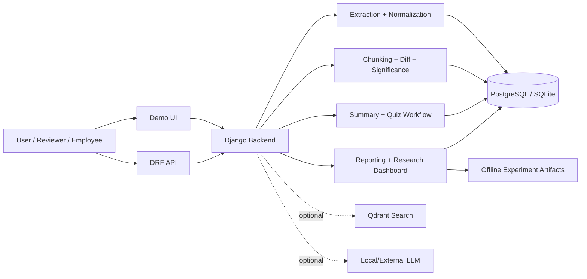
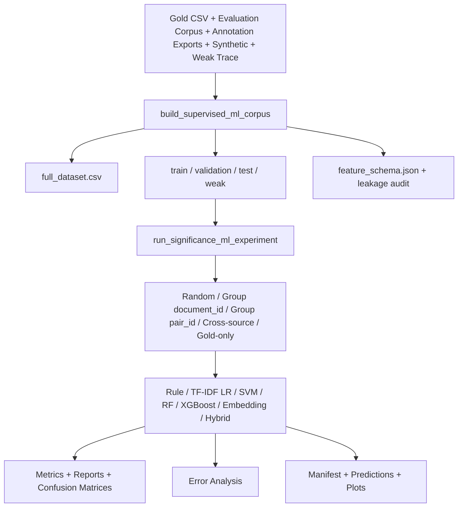
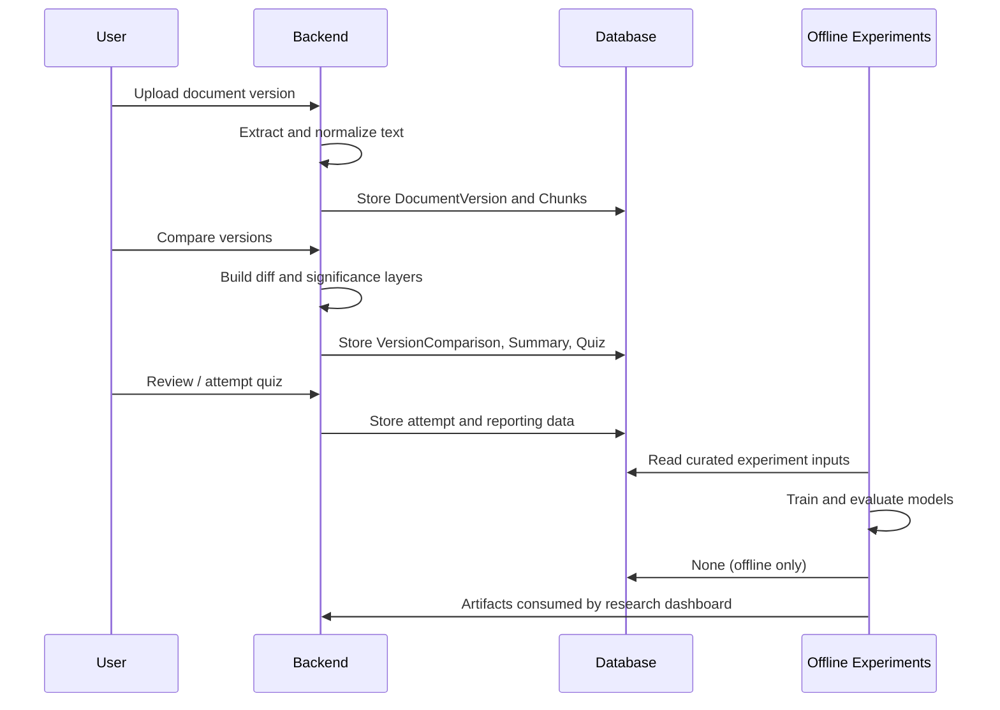
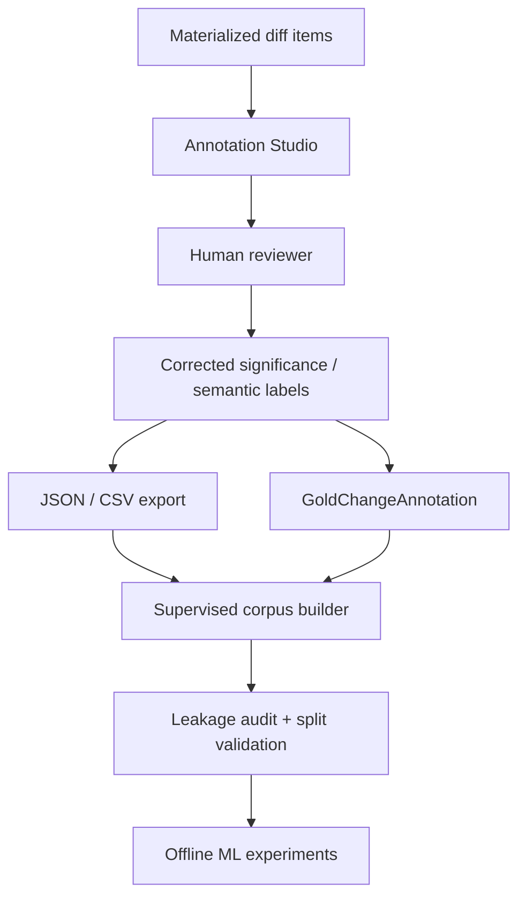

# Engineering Diagrams

## System architecture

```mermaid
flowchart LR
    User[User / Reviewer / Employee] --> DemoUI[Demo UI]
    User --> API[DRF API]
    DemoUI --> Django[Django Backend]
    API --> Django

    Django --> Ingestion[Extraction + Normalization]
    Django --> Domain[Chunking + Diff + Significance]
    Django --> Quiz[Summary + Quiz Workflow]
    Django --> Reporting[Reporting + Research Dashboard]

    Ingestion --> DB[(PostgreSQL / SQLite)]
    Domain --> DB
    Quiz --> DB
    Reporting --> DB

    Django -. optional .-> Qdrant[Qdrant Search]
    Django -. optional .-> LLM[Local/External LLM]
    Reporting --> Experiments[Offline Experiment Artifacts]
```

## ML pipeline

```mermaid
flowchart TD
    Sources[Gold CSV + Evaluation Corpus + Annotation Exports + Synthetic + Weak Trace] --> Corpus[build_supervised_ml_corpus]
    Corpus --> Full[full_dataset.csv]
    Corpus --> Splits[train / validation / test / weak]
    Corpus --> Schema[feature_schema.json + leakage audit]

    Splits --> Runner[run_significance_ml_experiment]
    Runner --> SplitStrategies[Random / Group document_id / Group pair_id / Cross-source / Gold-only]
    SplitStrategies --> Models[Rule / TF-IDF LR / SVM / RF / XGBoost / Embedding / Hybrid]
    Models --> Metrics[Metrics + Reports + Confusion Matrices]
    Models --> Errors[Error Analysis]
    Models --> Artifacts[Manifest + Predictions + Plots]
```

## Data flow

```mermaid
sequenceDiagram
    participant U as User
    participant B as Backend
    participant D as Database
    participant X as Offline Experiments

    U->>B: Upload document version
    B->>B: Extract and normalize text
    B->>D: Store DocumentVersion and Chunks
    U->>B: Compare versions
    B->>B: Build diff and significance layers
    B->>D: Store VersionComparison, Summary, Quiz
    U->>B: Review / attempt quiz
    B->>D: Store attempt and reporting data
    X->>D: Read curated experiment inputs
    X->>X: Train and evaluate models
    X->>D: None (offline only)
    X->>B: Artifacts consumed by research dashboard
```

## Annotation workflow

```mermaid
flowchart TD
    Diff[Materialized diff items] --> Studio[Annotation Studio]
    Studio --> Reviewer[Human reviewer]
    Reviewer --> Corrected[Corrected significance / semantic labels]
    Corrected --> Export[JSON / CSV export]
    Corrected --> DB[GoldChangeAnnotation]
    Export --> Corpus[Supervised corpus builder]
    DB --> Corpus
    Corpus --> Audit[Leakage audit + split validation]
    Audit --> Experiments[Offline ML experiments]
```
