# Entity Relationship Diagram

## 1. Назначение

Документ фиксирует ERD ключевых сущностей разработанной информационной системы после Фазы 6 и в рамках Фазы 7. ERD описывает фактические Django ORM-модели, которые поддерживают полный MVP pipeline:

```text
Document → DocumentVersion → Chunk → VersionComparison → VersionChangeItem → Summary → GeneratedQuiz → Question/Choice → QuizAttempt/Answer → result/reporting payload
```

ERD не добавляет новые сущности и не предполагает новые миграции. Отдельной модели `Result` или `Report` в проекте нет: результат прохождения материализуется в `QuizAttempt`, `Answer` и reporting/LLM cache-полях.

## 2. Основные сущности

| Entity | Назначение | Ключевые поля | Связи |
|---|---|---|---|
| `Document` | Логический документ, объединяющий версии | `document_key`, `title`, `description`, `current_version`, `created_at`, `updated_at` | `Document` имеет много `DocumentVersion`; имеет много `VersionComparison`; optional `current_version` указывает на актуальную версию |
| `DocumentVersion` | Конкретная редакция документа | `document`, `version_number`, `source_filename`, `source_revision_id`, `effective_date`, `file`, `file_size`, `content_type`, `extracted_text`, `normalized_text`, `content_hash`, `created_at` | Принадлежит `Document`; имеет много `Chunk`; участвует в `VersionComparison` как `from_version`/`to_version`; участвует в `GeneratedQuiz` |
| `Chunk` | Materialized структурный фрагмент версии | `version`, `chunk_index`, `fragment_type`, `structure_level`, `raw_label`, `canonical_label`, `path_key`, `section_path`, `heading`, `text`, `text_hash`, `token_count` | Принадлежит `DocumentVersion`; может быть связан с `VersionChangeItem` как `old_chunk` или `new_chunk`; имеет `ChunkAnalysis` |
| `ChunkAnalysis` | Снимок анализа сущностей для чанка | `chunk`, `extraction_method`, `entities`, `entities_count`, `created_at`, `updated_at` | Принадлежит `Chunk`; уникален по паре `chunk + extraction_method` |
| `VersionComparison` | Materialized сравнение двух версий одного документа | `document`, `from_version`, `to_version`, `status`, `comparison_unit`, `matching_strategy`, `identical`, counters, timestamps | Принадлежит `Document`; связывает две `DocumentVersion`; содержит `VersionChangeItem`; имеет один `Summary`; может порождать `GeneratedQuiz` |
| `VersionChangeItem` | Materialized изменение и significance snapshot | `comparison`, `change_type`, `old_chunk`, `new_chunk`, `old_text`, `new_text`, `similarity`, `match_reason`, `semantic_type`, `extracted_entities`, `significance_label`, `significance_score`, `significance_reason`, `significance_rules`, `requires_manual_review`, `sort_order` | Принадлежит `VersionComparison`; может ссылаться на old/new `Chunk`; может быть source для `Question` |
| `Summary` | Краткая выжимка по сравнению | `comparison`, `text`, `highlights`, timestamps | One-to-one с `VersionComparison`; может быть основой для `GeneratedQuiz` |
| `Employee` | Сотрудник/участник прохождения | `full_name`, `position`, `department`, `email`, `is_active` | Может иметь много `QuizAttempt`; в MVP роль сценарная, не production RBAC |
| `GeneratedQuiz` | Materialized quiz по паре версий | `comparison`, `summary`, `from_version`, `to_version`, `title`, `payload`, `questions_count`, `status`, approval/rejection/supersede fields, reporting cache fields | Связан с `VersionComparison`, `Summary`, двумя `DocumentVersion`; содержит `Question`; имеет много `QuizAttempt` |
| `Question` | Материализованный вопрос теста | `quiz`, `source_change_item`, `order`, `question_type`, `prompt`, `explanation`, `correct_text_answer` | Принадлежит `GeneratedQuiz`; может ссылаться на `VersionChangeItem`; имеет много `Choice`; имеет много `Answer` |
| `Choice` | Вариант ответа | `question`, `order`, `text`, `is_correct` | Принадлежит `Question`; может быть выбран в `Answer` |
| `QuizAttempt` | Попытка прохождения quiz | `quiz`, `employee`, `participant_name`, `answers`, `score`, `total_questions`, `answered_questions`, `correct_answers`, `score_percent`, `status`, timestamps, `llm_feedback*` | Принадлежит `GeneratedQuiz`; optional связан с `Employee`; содержит `Answer`; хранит result snapshot |
| `Answer` | Нормализованный ответ в попытке | `attempt`, `question`, `selected_choice`, `text_answer`, `is_correct`, `created_at` | Принадлежит `QuizAttempt`; связан с `Question`; optional связан с `Choice` |

## 3. ERD Mermaid Diagram

```mermaid
erDiagram
    DOCUMENT ||--o{ DOCUMENT_VERSION : has
    DOCUMENT_VERSION ||--o{ CHUNK : materializes
    CHUNK ||--o{ CHUNK_ANALYSIS : analyzed_by

    DOCUMENT ||--o{ VERSION_COMPARISON : has
    DOCUMENT_VERSION ||--o{ VERSION_COMPARISON : from_version
    DOCUMENT_VERSION ||--o{ VERSION_COMPARISON : to_version
    VERSION_COMPARISON ||--o{ VERSION_CHANGE_ITEM : contains
    CHUNK ||--o{ VERSION_CHANGE_ITEM : old_chunk
    CHUNK ||--o{ VERSION_CHANGE_ITEM : new_chunk
    VERSION_COMPARISON ||--|| SUMMARY : produces

    VERSION_COMPARISON ||--o{ GENERATED_QUIZ : produces
    SUMMARY ||--o{ GENERATED_QUIZ : based_on
    DOCUMENT_VERSION ||--o{ GENERATED_QUIZ : from_version
    DOCUMENT_VERSION ||--o{ GENERATED_QUIZ : to_version
    GENERATED_QUIZ ||--o{ QUESTION : contains
    VERSION_CHANGE_ITEM ||--o{ QUESTION : sources
    QUESTION ||--o{ CHOICE : has

    EMPLOYEE ||--o{ QUIZ_ATTEMPT : makes
    GENERATED_QUIZ ||--o{ QUIZ_ATTEMPT : attempted_by
    QUIZ_ATTEMPT ||--o{ ANSWER : contains
    QUESTION ||--o{ ANSWER : answered_by
    CHOICE ||--o{ ANSWER : selected_in

    DOCUMENT {
        bigint id PK
        string document_key UK
        string title
        text description
        bigint current_version_id FK
        datetime created_at
        datetime updated_at
    }

    DOCUMENT_VERSION {
        bigint id PK
        bigint document_id FK
        int version_number
        string source_filename
        string source_revision_id
        date effective_date
        string file
        bigint file_size
        string content_type
        text extracted_text
        text normalized_text
        string content_hash
        datetime created_at
    }

    CHUNK {
        bigint id PK
        bigint version_id FK
        int chunk_index
        string fragment_type
        int structure_level
        string raw_label
        string canonical_label
        string path_key
        string section_path
        string heading
        text text
        string text_hash
        int token_count
        datetime created_at
    }

    CHUNK_ANALYSIS {
        bigint id PK
        bigint chunk_id FK
        string extraction_method
        json entities
        int entities_count
        datetime created_at
        datetime updated_at
    }

    VERSION_COMPARISON {
        bigint id PK
        bigint document_id FK
        bigint from_version_id FK
        bigint to_version_id FK
        string status
        string comparison_unit
        string matching_strategy
        bool identical
        int added_count
        int removed_count
        int modified_count
        int moved_count
        int unchanged_count
        datetime created_at
        datetime updated_at
    }

    VERSION_CHANGE_ITEM {
        bigint id PK
        bigint comparison_id FK
        string change_type
        bigint old_chunk_id FK
        bigint new_chunk_id FK
        text old_text
        text new_text
        float similarity
        string match_reason
        string semantic_type
        json extracted_entities
        string significance_label
        float significance_score
        text significance_reason
        json significance_rules
        bool requires_manual_review
        int sort_order
        datetime created_at
    }

    SUMMARY {
        bigint id PK
        bigint comparison_id FK
        text text
        json highlights
        datetime created_at
        datetime updated_at
    }

    EMPLOYEE {
        bigint id PK
        string full_name
        string position
        string department
        string email
        bool is_active
        datetime created_at
        datetime updated_at
    }

    GENERATED_QUIZ {
        bigint id PK
        bigint comparison_id FK
        bigint summary_id FK
        bigint from_version_id FK
        bigint to_version_id FK
        string title
        json payload
        int questions_count
        string status
        datetime submitted_for_review_at
        string approved_by_name
        datetime approved_at
        text approval_comment
        string rejected_by_name
        datetime rejected_at
        text rejection_comment
        datetime superseded_at
        text superseded_reason
        text llm_error_analysis
        text llm_manager_summary
        string llm_reporting_cache_key
        string llm_reporting_model
        datetime llm_reporting_generated_at
        datetime created_at
        datetime updated_at
    }

    QUESTION {
        bigint id PK
        bigint quiz_id FK
        bigint source_change_item_id FK
        int order
        string question_type
        text prompt
        text explanation
        text correct_text_answer
        datetime created_at
    }

    CHOICE {
        bigint id PK
        bigint question_id FK
        int order
        text text
        bool is_correct
    }

    QUIZ_ATTEMPT {
        bigint id PK
        bigint quiz_id FK
        bigint employee_id FK
        string participant_name
        json answers
        int score
        int total_questions
        int answered_questions
        int correct_answers
        float score_percent
        text llm_feedback
        string llm_feedback_cache_key
        string llm_feedback_model
        datetime llm_feedback_generated_at
        string status
        datetime started_at
        datetime submitted_at
        datetime created_at
        datetime completed_at
    }

    ANSWER {
        bigint id PK
        bigint attempt_id FK
        bigint question_id FK
        bigint selected_choice_id FK
        text text_answer
        bool is_correct
        datetime created_at
    }
```



## 4. Materialized artifacts

ERD отражает материализацию всех ключевых этапов pipeline:

| Pipeline artifact | Entity / field | Комментарий |
|---|---|---|
| Исходный файл версии | `DocumentVersion.file` | Файл хранится в media storage |
| Извлечённый текст | `DocumentVersion.extracted_text` | Результат stage `E` |
| Нормализованный текст | `DocumentVersion.normalized_text` | Результат stage `N` |
| Hash содержимого | `DocumentVersion.content_hash` | Duplicate guard и воспроизводимость |
| Structural chunks | `Chunk` | Результат stage `S` |
| Optional entity analysis | `ChunkAnalysis` | Rule/LLM entity extraction snapshots |
| Сравнение | `VersionComparison` | Результат orchestration stage `C` |
| Изменения | `VersionChangeItem` | Diff item + text snapshots |
| Significance | fields on `VersionChangeItem` | Результат stage `P` без отдельной таблицы |
| Summary | `Summary` | Human-readable bridge to quiz generation |
| Quiz | `GeneratedQuiz`, `Question`, `Choice` | Результат stage `G` |
| Approval workflow | fields on `GeneratedQuiz` | Human-in-the-loop контроль |
| Attempt/result | `QuizAttempt`, `Answer` | Результат stage `R` |
| Reporting cache | fields on `QuizAttempt`, `GeneratedQuiz` | Optional LLM/deterministic feedback cache |

## 5. Ограничения модели данных

- Отдельная таблица `Result` или `Report` отсутствует: результат хранится как snapshot в `QuizAttempt`, нормализованные ответы — в `Answer`, агрегированный report строится сервисом `result_reporting.py`.
- Significance не вынесена в отдельную модель: `semantic_type`, `significance_label`, `significance_score`, `significance_reason`, `significance_rules`, `requires_manual_review` хранятся на `VersionChangeItem`.
- `GeneratedQuiz.payload` и `QuizAttempt.answers` сохраняют JSON snapshots для совместимости и трассируемости; нормализованные `Question`, `Choice`, `Answer` также присутствуют.
- `Employee` является простой participant-like сущностью. Полноценная production auth/RBAC-модель не входит в MVP.
- `ChunkAnalysis` отражает optional entity extraction. Core pipeline не зависит от LLM entity extraction.
- SQLite используется локально; PostgreSQL поддержан настройками и Docker Compose, но не является обязательным runtime для MVP.

## 6. Связь ERD с pipeline

| Этап метода | Основные сущности ERD | Связь с pipeline |
|---|---|---|
| `E` | `DocumentVersion` | `file → extracted_text` |
| `N` | `DocumentVersion` | `extracted_text → normalized_text + content_hash` |
| `S` | `Chunk` | `normalized_text → structural chunks` |
| `C` | `VersionComparison`, `VersionChangeItem` | `old/new chunks → materialized diff` |
| `P` | `VersionChangeItem` | `diff item → semantic/significance fields` |
| `G` | `Summary`, `GeneratedQuiz`, `Question`, `Choice` | `prioritized changes → summary → quiz` |
| `R` | `QuizAttempt`, `Answer` | `approved quiz + submitted answers → score/result/report` |

## 7. Вывод

ERD подтверждает, что система хранит не только финальный результат, но и всю проверяемую цепочку intermediate artifacts. Это делает pipeline воспроизводимым, объяснимым и пригодным для научного описания в главе 2 диссертации.
