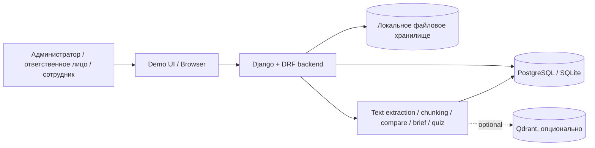
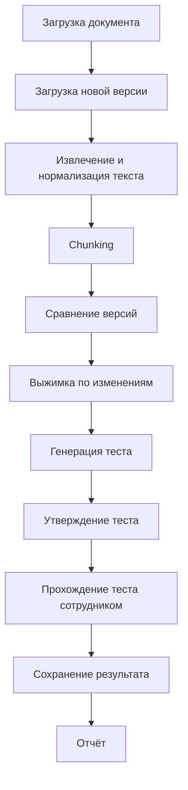
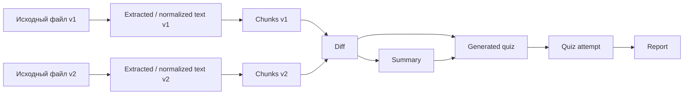
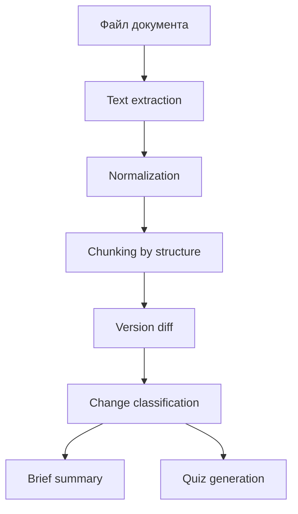
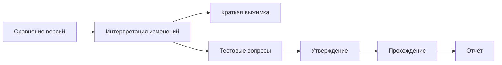

# Diagrams

## 1. Архитектурная схема

```mermaid
flowchart LR
    U[Администратор / ответственное лицо / сотрудник]
    UI[Demo UI / Browser]
    API[Django + DRF backend]
    DB[(PostgreSQL / SQLite)]
    FS[(Локальное файловое хранилище)]
    NLP[Text extraction / chunking / compare / brief / quiz]
    Q[(Qdrant, опционально)]

    U --> UI
    UI --> API
    API --> DB
    API --> FS
    API --> NLP
    NLP --> DB
    NLP -. optional .-> Q
```

## 2. Основной пользовательский сценарий

```mermaid
flowchart TD
    A[Загрузка документа] --> B[Загрузка новой версии]
    B --> C[Извлечение и нормализация текста]
    C --> D[Chunking]
    D --> E[Сравнение версий]
    E --> F[Выжимка по изменениям]
    F --> G[Генерация теста]
    G --> H[Утверждение теста]
    H --> I[Прохождение теста сотрудником]
    I --> J[Сохранение результата]
    J --> K[Отчёт]
```

## 3. Поток данных

```mermaid
flowchart LR
    F1[Исходный файл v1]
    F2[Исходный файл v2]
    T1[Extracted / normalized text v1]
    T2[Extracted / normalized text v2]
    C1[Chunks v1]
    C2[Chunks v2]
    D[Diff]
    S[Summary]
    QZ[Generated quiz]
    A[Quiz attempt]
    R[Report]

    F1 --> T1 --> C1 --> D
    F2 --> T2 --> C2 --> D
    D --> S
    D --> QZ
    S --> QZ
    QZ --> A --> R
```

## 4. AI/NLP-слой

```mermaid
flowchart TD
    X[Файл документа] --> E[Text extraction]
    E --> N[Normalization]
    N --> CH[Chunking by structure]
    CH --> CMP[Version diff]
    CMP --> CLS[Change classification]
    CLS --> SUM[Brief summary]
    CLS --> QUIZ[Quiz generation]
```

## 5. Compare → Summary → Quiz

```mermaid
flowchart LR
    CMP[Сравнение версий] --> IMP[Интерпретация изменений]
    IMP --> SUM[Краткая выжимка]
    IMP --> QUIZ[Тестовые вопросы]
    QUIZ --> APPROVE[Утверждение]
    APPROVE --> ATTEMPT[Прохождение]
    ATTEMPT --> REPORT[Отчёт]
```
