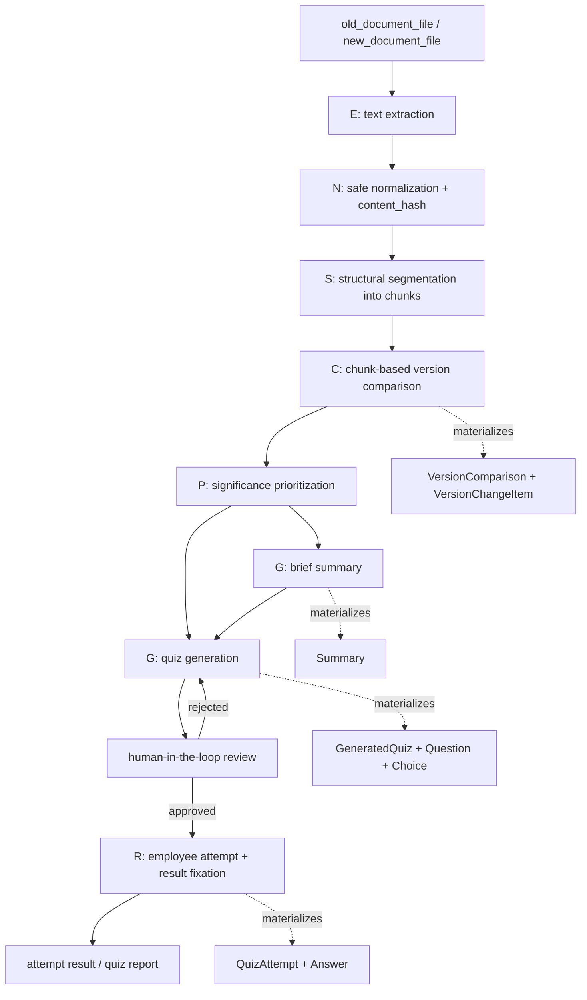

# Hybrid Method for Intelligent Analysis of Regulatory Document Changes

## 1. Назначение документа

Документ формализует реализованный в проекте pipeline как гибридный метод интеллектуального анализа изменений нормативно-правовых и внутренних регламентных документов. Цель документа — подготовить основу для раздела 2.1 магистерской диссертации и зафиксировать, что именно является методом, какие этапы входят в него, какие входы и выходы имеют эти этапы, какие правила обработки применяются и какие ограничения остаются в рамках MVP.

Документ не вводит новые runtime-функции, модели данных или интеграции. Он описывает фактическое состояние проекта после Фазы 5: локальный воспроизводимый цикл «версия документа → анализ изменений → выжимка → тест → утверждение → прохождение → результат».

## 2. Контекст и задача

Проект представляет собой локальную интеллектуальную систему для работы с нормативно-правовыми и внутренними регламентными документами. Система не является универсальным юридическим чат-ботом, аналогом внешних правовых систем, полноценной LMS, enterprise BI-системой, OCR-платформой, RAG-first или LangGraph-first системой.

Основная прикладная задача состоит в том, чтобы принять две редакции одного документа, извлечь и нормализовать текст, разложить документ на структурные фрагменты, сопоставить редакции, выделить и приоритизировать изменения, сформировать краткую выжимку и проверочный тест, провести human-in-the-loop утверждение теста, зафиксировать прохождение сотрудником и сформировать результат/reporting.

Главный объект данных — `Document` и `DocumentVersion`. Основные материализованные артефакты pipeline — `Chunk`, `VersionComparison`, `VersionChangeItem`, `Summary`, `GeneratedQuiz`, `Question`, `Choice`, `QuizAttempt` и `Answer`.

## 3. Почему нужна формализация метода

Наличие работающей Django-системы само по себе не является достаточным научным результатом для магистерской диссертации. Для защиты необходимо показать, что за реализацией стоит формализованный метод: определённая последовательность этапов, преобразующая входные документы в воспроизводимые аналитические и контрольно-обучающие артефакты.

Формализация метода нужна для трёх целей:

1. отделить научное ядро проекта от интерфейсных, demo и инфраструктурных деталей;
2. показать воспроизводимость pipeline за счёт материализации промежуточных результатов;
3. задать структуру будущей экспериментальной оценки chunking, diff, significance, summary и quiz generation.

## 4. Общая формула метода

Предлагаемый метод задаётся кортежем:

```text
M = <E, N, S, C, P, G, R>
```

где:

- `E` — extraction, извлечение текстового содержимого из входного файла документа;
- `N` — normalization, нормализация извлечённого текста;
- `S` — structural segmentation, структурное разбиение документа на фрагменты;
- `C` — comparison, сопоставление двух редакций документа;
- `P` — prioritization / significance, оценка значимости изменений;
- `G` — generation, формирование выжимки и контрольно-обучающих материалов;
- `R` — result fixation, фиксация результата прохождения и reporting.

Метод является version-first: анализ выполняется не по произвольному корпусу документов, а по двум версиям одного документа, удовлетворяющим ограничениям модели `VersionComparison`: версии принадлежат одному `Document`, целевая версия новее исходной, версии различны.

## 5. Расшифровка этапов метода

### 5.1 E — Extraction

**Цель этапа.** Преобразовать входной файл версии документа в текстовое представление `extracted_text`, пригодное для последующей нормализации и структурного анализа.

**Входные данные.** Файл версии документа, связанный с `DocumentVersion`: TXT, DOCX или PDF с извлекаемым текстовым слоем.

**Выходные данные.** Поле `DocumentVersion.extracted_text`, а также техническая информация о расширении файла и предсказуемые ошибки extraction.

**Основные операции.** Реализация находится в `backend/documents/domain/text_extractors.py`:

- определение расширения файла по имени;
- извлечение TXT с последовательной попыткой кодировок `utf-8-sig`, `utf-8`, `cp1251`, `cp866`;
- извлечение DOCX через `python-docx` с сохранением порядка параграфов и таблиц; содержимое таблиц представляется строками с разделением ячеек;
- извлечение PDF через `pypdf.PdfReader` и `page.extract_text()`; страницы соединяются маркером `PDF_PAGE_BREAK`;
- формирование `ProcessedDocumentText`, который содержит `extracted_text`, `normalized_text`, `content_hash` и расширение.

**Используемый подход.** Deterministic document processing. На этапе extraction не применяется LLM и не выполняется OCR.

**Роль в общем методе.** `E` задаёт первичный текстовый слой для всех последующих этапов. Если текст не извлекается, downstream-этапы не могут быть выполнены корректно.

**Возможные ошибки.** В коде явно выделены `UnsupportedFileTypeError`, `EmptyExtractedTextError` и `InvalidDocumentFileError`. Для PDF без извлекаемого текста возвращается ошибка с указанием, что OCR не поддерживается в текущем scope.

**Ограничения.** Поддерживаются только `.txt`, `.docx`, `.pdf`. PDF должен содержать текстовый слой. Сканированные документы без OCR не входят в MVP. Качество извлечения PDF зависит от доступности и качества текстового слоя.

**Связь с реализацией.** Этап вызывается из `backend/documents/services/ingestion.py` при загрузке версии через `ingest_uploaded_document_version`. Результаты сохраняются в `DocumentVersion.extracted_text`, `DocumentVersion.normalized_text` и `DocumentVersion.content_hash`.

**Обоснование выбора.** Для MVP выбран локальный и воспроизводимый extraction без внешних сервисов. Это соответствует local-first характеру проекта и исключает сетевые зависимости при демонстрации и тестировании.

### 5.2 N — Normalization

**Цель этапа.** Привести извлечённый текст к устойчивому виду для chunking, comparison и downstream-аналитики, не разрушая юридически значимую структуру документа.

**Входные данные.** `extracted_text` и расширение источника.

**Выходные данные.** `normalized_text` и `content_hash`, сохраняемые в `DocumentVersion`.

**Основные операции.** Реализация находится в `backend/documents/domain/text_processing.py`:

- Unicode-нормализация `NFC`;
- замена неразрывных и специальных пробелов обычным пробелом;
- унификация длинных тире и дефисов;
- удаление zero-width и управляющих символов;
- нормализация переводов строк;
- сжатие повторяющихся пробелов и избыточных пустых строк;
- для PDF — предварительная обработка page-boundary артефактов, удаление повторяющихся верхних/нижних строк страниц, удаление типовых номеров страниц, склейка переносов и переносов строк, если они выглядят как продолжение предложения;
- вычисление SHA-256 hash от нормализованного текста.

**Используемый подход.** Rule-based deterministic normalization.

**Роль в общем методе.** `N` повышает устойчивость структурного разбиения и сравнения редакций. `content_hash` используется для duplicate guard при загрузке версии документа.

**Возможные ошибки.** После нормализации текст может оказаться пустым; такая версия не может быть материализована. Неправильный текстовый слой PDF может привести к неполной или плохо структурированной нормализации.

**Ограничения.** Нормализация намеренно не является агрессивной: она не перестраивает смысл, не выполняет paraphrase, не удаляет юридически значимые маркеры структуры и не заменяет полноценную юридическую экспертизу. Для нормативных текстов агрессивная нормализация опасна, потому что номера пунктов, абзацев, формулировки сроков и обязанностей имеют правовое значение.

**Связь с реализацией.** `materialize_document_text` вызывается из `process_uploaded_file`, `ingest_text_document_version` и `rebuild_version_chunks`. Результаты сохраняются в `DocumentVersion.normalized_text` и `DocumentVersion.content_hash`.

**Обоснование выбора.** Safe normalization позволяет улучшить техническую сопоставимость редакций, сохранив traceability исходных формулировок.

### 5.3 S — Structural Segmentation

**Цель этапа.** Разбить нормализованный документ на структурно осмысленные фрагменты, пригодные для сопоставления редакций.

**Входные данные.** `normalized_text` версии документа.

**Выходные данные.** Набор `Chunk`, связанный с `DocumentVersion`: `chunk_index`, `fragment_type`, `structure_level`, `raw_label`, `canonical_label`, `path_key`, `section_path`, `heading`, `text`, `text_hash`.

**Основные операции.** Реализация находится в `backend/documents/domain/text_processing.py` и `backend/documents/services/ingestion.py`:

- распознавание заголовка, преамбулы, разделов, глав, статей, пунктов, подпунктов, абзацев и fallback-блоков;
- использование регулярных выражений для русскоязычных структурных маркеров: `раздел`, `глава`, `статья`, `пункт`, `подпункт`, `абзац`, числовые маркеры, буквенные подпункты;
- построение структурных метаданных: `fragment_type`, `structure_level`, `canonical_label`, `path_key`, `section_path`;
- сохранение порядка фрагментов через `chunk_index`;
- разбиение слишком крупных блоков с ограничениями `MAX_CHUNK_LEN` и `SOFT_CHUNK_LEN`;
- fallback на paragraph/block segmentation, если явная структура не распознана.

**Используемый подход.** Rule-based structural document intelligence. Это не plain paragraph split и не embedding-based chunking.

**Роль в общем методе.** `S` задаёт единицу сравнения редакций. Для нормативных документов структурные фрагменты полезнее простого paragraph split, потому что изменения обычно привязаны к статьям, пунктам, подпунктам и абзацам, а не к произвольным абзацам текста.

**Возможные ошибки.** Нестандартная верстка, нарушенные переносы PDF, необычные маркеры пунктов или плохо извлечённые таблицы могут приводить к fallback-блокам, укрупнению фрагментов или ошибкам path matching.

**Ограничения.** Метод не обещает универсальное структурное распознавание всех юридических форматов. Он реализует объяснимый baseline для русскоязычных нормативных и регламентных текстов и сохраняет fallback-блоки там, где структура не распознана уверенно.

**Связь с реализацией.** `rebuild_version_chunks` вызывает `chunk_by_structure_ru` и материализует результат в модели `Chunk`. При включённом `QDRANT_ENABLED` может быть выполнена опциональная индексация chunks, но semantic search не является обязательной частью метода.

**Обоснование выбора.** Структурно-ориентированное разбиение делает comparison более интерпретируемым и позволяет сохранять ссылки на источник изменения для summary и quiz.

### 5.4 C — Comparison

**Цель этапа.** Сопоставить две версии одного документа и выделить материализованные изменения между ними.

**Входные данные.** `old_version_chunks` и `new_version_chunks`, то есть `Chunk` исходной и целевой версии. Если chunks отсутствуют, используется fallback на сравнение текста документа целиком.

**Выходные данные.** `VersionComparison`, набор `VersionChangeItem`, а также diff payload с группами `added`, `removed`, `modified`, `moved`, счётчиками и `unchanged_count`.

**Основные операции.** Реализация находится в `backend/documents/domain/diff.py` и `backend/documents/services/workflows.py`:

- проверка пары версий через `validate_version_pair`;
- сериализация chunks с текстом и структурными метаданными;
- точное сопоставление chunks по hash для unchanged/moved;
- сопоставление изменённых chunks по первичным структурным anchor-признакам: `path_key`, `canonical_label`, `heading`, `section_path`;
- fallback-сопоставление изменённых chunks с использованием текстовой близости и близости индексов;
- построение unified text diff для modified items;
- выделение `added`, `removed`, `modified`, `moved`, `unchanged_count`;
- материализация результата в `VersionComparison` и `VersionChangeItem` через `materialize_comparison`.

**Используемый подход.** Deterministic chunk-based diff with structural matching. Используется текстовая близость как эвристика сопоставления фрагментов, но не применяется embedding similarity как обязательный механизм.

**Роль в общем методе.** `C` превращает две редакции документа в набор объяснимых change items. Это центральный аналитический этап, от которого зависят significance, summary и quiz generation.

**Возможные ошибки.** Если структурное разбиение нестабильно между версиями, часть изменений может быть классифицирована как added/removed вместо modified. Перемещение может быть определено только при достаточных признаках совпадения. При отсутствии chunks используется document-text fallback, менее точный и менее структурно объяснимый.

**Ограничения.** Это не полноценный legal diff engine для любых форматов и не семантическое сравнение норм. Метод фиксирует структурно-текстовые изменения, но не выводит юридические последствия автоматически.

**Связь с реализацией.** `build_comparison_payload` строит diff payload, `materialize_comparison` сохраняет comparison и change items. Модель `VersionComparison` фиксирует `comparison_unit`, `matching_strategy`, `identical` и счётчики изменений.

**Обоснование выбора.** Chunk-based comparison лучше plain text diff для нормативных документов, потому что сохраняет связь изменения с разделом, статьёй или пунктом и делает последующую генерацию вопросов traceable.

### 5.5 P — Prioritization / Significance

**Цель этапа.** Оценить содержательную значимость найденных изменений и отделить потенциально важные изменения от редакционных и информационных.

**Входные данные.** Diff items / `VersionChangeItem` candidates с текстом старого и нового фрагмента, типом изменения и структурными метаданными.

**Выходные данные.** `semantic_type`, `significance_label`, `significance_score`, `significance_reason`, `significance_rules`, `requires_manual_review`, `extracted_entities`.

**Основные операции.** Реализация находится в `backend/documents/domain/change_enrichment.py`, `backend/documents/domain/change_classification.py` и `backend/documents/services/importance.py`:

- извлечение текстов изменения из added/removed/modified/moved payload;
- baseline entity extraction для сроков и документов;
- классификация semantic type: deadline, document, obligation, procedure, refusal, condition, responsibility, informational, editorial, structure, unclassified;
- оценка significance label: critical, important, informational, editorial, not_evaluated;
- присвоение score в диапазоне 0.0–1.0;
- фиксация rule explanations и triggered rules;
- определение необходимости ручной проверки `requires_manual_review` для более рискованных или неоднозначных изменений;
- сортировка и выбор приоритетных изменений для summary и quiz.

**Используемый подход.** Rule-based baseline with domain-specific heuristics. Optional AI/entity extraction существует отдельно, но базовый contour significance не зависит от LLM.

**Роль в общем методе.** `P` делает результаты comparison пригодными для пользователя: не все изменения одинаково важны для обучения сотрудников. Этап определяет, какие изменения попадут в краткую выжимку и станут кандидатами для quiz questions.

**Возможные ошибки.** Эвристики могут переоценивать или недооценивать значимость, особенно при сложных юридических формулировках, косвенных изменениях или нестандартной лексике. Editorial change может быть ошибочно воспринят как содержательный и наоборот.

**Ограничения.** В рамках MVP significance — объяснимый baseline, а не обученная модель правовой значимости. Метод не выполняет автоматическую юридическую экспертизу и не гарантирует исчерпывающую оценку последствий изменения.

**Связь с реализацией.** `enrich_compare_payload` добавляет enrichment к diff payload. `materialize_comparison` сохраняет эти признаки в `VersionChangeItem`. `services/importance.py` содержит отдельный rule-based classifier для строк изменений и используется как часть significance baseline.

**Обоснование выбора.** Для магистерского MVP важно иметь воспроизводимую, объяснимую и тестируемую приоритизацию. Rule-based признаки проще валидировать и обсуждать в экспериментальной части, чем полностью black-box модель.

### 5.6 G — Generation of Control-Learning Materials

**Цель этапа.** Превратить приоритетные изменения в человекочитаемую выжимку и проверочные материалы для сотрудников.

**Входные данные.** Enriched diff payload, `VersionChangeItem`, significant changes, `Summary.highlights` и связанные structural chunks.

**Выходные данные.** `Summary.text`, `Summary.highlights`, `GeneratedQuiz`, `Question`, `Choice`, correct answers, explanations и source references на `VersionChangeItem`.

**Основные операции.** Реализация находится в `backend/documents/domain/diff_summary.py`, `backend/documents/domain/diff_quiz.py`, `backend/documents/services/workflows.py` и `backend/documents/services/quiz_workflow.py`:

- построение brief summary на основе enriched diff payload;
- подсчёт распределения по significance и количества изменений, требующих ручной проверки;
- выбор highlights через приоритетный порядок значимости и типа изменения;
- формирование `Summary.text` и `Summary.highlights`;
- привязка highlights к `VersionChangeItem` через `source_change_item_id`;
- генерация quiz payload из summary highlights;
- отбор quiz candidates: значимые и структурно осмысленные изменения;
- генерация single-choice вопросов, вариантов ответа, корректного варианта и explanation;
- материализация quiz в `GeneratedQuiz`, `Question`, `Choice`;
- перевод quiz в lifecycle `draft -> pending_review -> approved` через human-in-the-loop workflow; также поддерживаются `rejected`, `superseded`, `archived`.

**Используемый подход.** Deterministic rule-based generation over materialized significant changes. LLM не является обязательным генератором quiz в текущем MVP.

**Роль в общем методе.** `G` соединяет анализ изменений с обучающим контуром. Пользователь получает не только список diff items, но и краткую выжимку и тест, проверяющий понимание значимых изменений.

**Возможные ошибки.** При недостатке значимых изменений quiz может быть пустым и не сохраняется. Сформулированные вопросы являются baseline-вопросами и требуют human review. Distractors и explanations строятся по шаблонным правилам и могут требовать редакторской корректировки.

**Ограничения.** В MVP поддерживается summary-aware single-choice generation по значимым изменениям. Система не является полноценной LMS, не поддерживает сложные учебные траектории и не гарантирует методическое качество без утверждения человеком.

**Связь с реализацией.** `create_quiz_from_versions` вызывает comparison/materialization, строит quiz payload через `build_quiz_from_summary`, сохраняет `GeneratedQuiz`, `Question`, `Choice` и supersede-ит предыдущие активные quiz drafts для той же пары версий. `quiz_workflow.py` запрещает прохождение неутверждённого или пустого quiz.

**Обоснование выбора.** Human-in-the-loop approval необходим, потому что автоматическая генерация учебных материалов по нормативным изменениям не должна быть полностью неконтролируемой. Утверждение человеком снижает риск некорректных или методически слабых вопросов.

### 5.7 R — Result Fixation

**Цель этапа.** Зафиксировать прохождение утверждённого quiz сотрудником, рассчитать результат и сформировать reporting payload.

**Входные данные.** Approved `GeneratedQuiz`, participant name / `Employee`, answers по вопросам, активная `QuizAttempt`.

**Выходные данные.** Завершённая `QuizAttempt`, `Answer` rows, score snapshot, correctness по каждому вопросу, deterministic feedback, quiz-level reporting payload и optional LLM-enhanced texts.

**Основные операции.** Реализация находится в `backend/documents/services/quiz_attempts.py`, `backend/documents/services/result_reporting.py`, `backend/documents/services/llm_result_enhancer.py`:

- проверка, что quiz approved и содержит materialized questions;
- создание или возврат active in-progress attempt для участника;
- при submit — evaluation ответов по сохранённым `Question` и `Choice`;
- фиксация `answers`, `score`, `total_questions`, `answered_questions`, `correct_answers`, `score_percent`;
- перевод attempt в `completed` с `submitted_at` и `completed_at`;
- сохранение строк `Answer`;
- построение attempt result payload;
- построение quiz report: attempts count, average score, average percentage, best score, pass rate, frequent errors;
- формирование deterministic fallback feedback;
- optional LLM enhancement для человекочитаемых комментариев при `RESULT_LLM_ENABLED=True`.

**Используемый подход.** Deterministic scoring and reporting with optional LLM enhancement. LLM не пересчитывает score и не меняет factual result snapshot.

**Роль в общем методе.** `R` завершает прикладной цикл: система не только анализирует изменения и создаёт quiz, но и фиксирует факт усвоения изменений сотрудником через воспроизводимый результат.

**Возможные ошибки.** Нельзя начать или отправить attempt для quiz без approval или materialized questions. Completed attempt является immutable на уровне модели. Reporting доступен только для completed attempts.

**Ограничения.** Результат не является production-grade HR analytics или enterprise BI. Auth/RBAC и личные кабинеты не входят в MVP; роли представлены сценарно. LLM-feedback — optional enhancement и может быть отключён без потери основного результата.

**Связь с реализацией.** `start_quiz_attempt` создаёт `QuizAttempt`, `submit_started_quiz_attempt` фиксирует scoring snapshot, `build_attempt_result_payload` и `build_quiz_report_payload` строят reporting. `docs/architecture/llm-fallback-modes.md` фиксирует, что `RESULT_LLM_ENABLED=False` — штатный deterministic режим.

**Обоснование выбора.** Материализация результата делает pipeline замкнутым, проверяемым и пригодным для демонстрации комиссии: от загрузки версии до результата прохождения.

## 6. Pipeline метода



Текстовая форма pipeline:

```text
document upload
→ document versioning
→ text extraction
→ normalization
→ structural chunking
→ version comparison
→ significance classification
→ summary
→ quiz generation
→ quiz approval workflow
→ employee attempt
→ result/reporting
```

## 7. Таблица этапов метода

| Symbol | Stage | Input | Output | Main operations | Role |
|---|---|---|---|---|---|
| E | Extraction | TXT/DOCX/PDF file with text layer | `extracted_text` | Decode TXT, parse DOCX paragraphs/tables, extract PDF text layer, handle predictable extraction errors | Creates textual source for version analysis |
| N | Normalization | `extracted_text` | `normalized_text`, `content_hash` | Unicode normalization, whitespace cleanup, safe dash/line normalization, PDF page artifact cleanup, SHA-256 hash | Stabilizes text for chunking, diff and duplicate guard |
| S | Structural segmentation | `normalized_text` | `Chunk` rows with structural metadata | Rule-based recognition of title, preamble, section, chapter, article, point, subpoint, paragraph, fallback blocks | Defines explainable comparison units |
| C | Comparison | old/new chunks | `VersionComparison`, `VersionChangeItem`, diff payload | Validate version pair, exact hash matching, structural anchor matching, similarity fallback, added/removed/modified/moved grouping | Materializes changes between versions |
| P | Prioritization / significance | change items / diff payload | `semantic_type`, `significance_label`, `significance_score`, reasons, rules | Rule-based entity and semantic heuristics for deadlines, documents, obligations, procedures, responsibility, editorial changes | Selects changes that matter for brief and quiz |
| G | Generation | significant changes, summary highlights, related chunks | `Summary`, `GeneratedQuiz`, `Question`, `Choice` | Build brief, select highlights, generate single-choice questions, attach source refs, require approval workflow | Converts analysis into control-learning materials |
| R | Result fixation | approved quiz, participant answers | `QuizAttempt`, `Answer`, score, feedback, report | Start/submit lifecycle, deterministic scoring, immutable completed snapshot, report aggregation, optional LLM feedback | Closes applied cycle by fixing learning result |

## 8. Псевдокод метода

```text
Input:
    old_document_file
    new_document_file
    participant_answers

Output:
    change_summary
    approved_quiz
    attempt_result

Method M:
    old_version = create_or_select_document_version(old_document_file)
    new_version = create_or_select_document_version(new_document_file)

    assert old_version.document == new_version.document
    assert old_version.version_number < new_version.version_number

    E_old = extract_text(old_document_file)
    E_new = extract_text(new_document_file)

    N_old = normalize_document_text(E_old)
    N_new = normalize_document_text(E_new)

    old_version.extracted_text = E_old
    old_version.normalized_text = N_old.text
    old_version.content_hash = N_old.hash

    new_version.extracted_text = E_new
    new_version.normalized_text = N_new.text
    new_version.content_hash = N_new.hash

    S_old = split_into_structural_chunks(N_old.text)
    S_new = split_into_structural_chunks(N_new.text)

    materialize_chunks(old_version, S_old)
    materialize_chunks(new_version, S_new)

    C = compare_versions(S_old, S_new)
    if S_old or S_new are unavailable:
        C = compare_document_texts(N_old.text, N_new.text)

    P = enrich_and_prioritize_changes(C)

    comparison = materialize_version_comparison(old_version, new_version, P)
    change_items = materialize_change_items(comparison, P)

    change_summary = generate_brief_summary(P)
    summary = materialize_summary(comparison, change_summary)

    quiz_draft = generate_quiz_from_summary(summary, change_items)
    if quiz_draft has no meaningful questions:
        stop with empty quiz error

    approved_quiz = human_review(quiz_draft)
    if approved_quiz.status != approved:
        stop; employee attempt is not allowed

    attempt = start_attempt(approved_quiz, participant)
    attempt_result = submit_attempt(attempt, participant_answers)

    reporting_payload = build_result_report(attempt_result)
    optional_llm_feedback = enhance_feedback_if_enabled(reporting_payload)

    return attempt_result
```

Псевдокод отражает фактическую реализацию: comparison, summary, quiz и result являются материализованными артефактами; LLM не участвует в обязательном scoring и не является обязательным для прохождения pipeline.

## 9. Почему метод является гибридным

Гибридность метода состоит не в том, что в системе «где-то используется ИИ», а в сочетании нескольких инженерно и научно различных подходов.

**Rule-based processing.** Нормализация текста, структурное распознавание, baseline significance, quiz generation, scoring и deterministic feedback реализованы через явные правила, регулярные выражения, структурные признаки и проверяемые условия.

**NLP / document intelligence.** Метод работает с естественным языком нормативных и регламентных документов: извлекает текст, сохраняет структуру документа, выделяет фрагменты, сопоставляет редакции и анализирует содержательные изменения на уровне фрагментов.

**Domain-specific heuristics.** В significance используются доменные признаки: сроки, документы, обязанности, ответственность, процедуры, условия, основания отказа и редакционные правки. Эти признаки отражают специфику нормативных документов и задач обучения сотрудников.

**Materialized workflow.** Промежуточные результаты не остаются ephemeral output одного black-box вызова. Система материализует chunks, comparison, change items, summary, quiz, questions, answers и attempt result. Это повышает воспроизводимость и проверяемость метода.

**Optional AI/LLM enhancement.** LLM может усиливать человекочитаемый feedback/reporting и optional entity extraction, но не является обязательной основой метода. Штатный режим `RESULT_LLM_ENABLED=False` сохраняет полный deterministic result/reporting payload.

Итоговая формулировка гибридности:

> Гибридный метод объединяет структурно-ориентированную обработку документов, rule-based эвристики, материализованный pipeline анализа изменений и автоматизированное формирование контрольно-обучающих материалов с возможностью optional AI-enhancement без зависимости от него.

## 10. Связь метода с архитектурой проекта

Метод `M = <E, N, S, C, P, G, R>` соответствует следующим реализациям проекта:

| Этап метода | Назначение | Реализация в проекте | Вход | Выход | Ограничения |
|---|---|---|---|---|---|
| E | Извлечение текста из файла версии | `backend/documents/domain/text_extractors.py`, `services/ingestion.py`, `DocumentVersion.extracted_text` | Uploaded file / text version | `extracted_text` | Только TXT/DOCX/PDF с текстовым слоем; OCR вне MVP |
| N | Безопасная нормализация текста | `backend/documents/domain/text_processing.py`, `materialize_document_text`, `DocumentVersion.normalized_text`, `content_hash` | `extracted_text` | `normalized_text`, hash | Не выполняет semantic rewrite; осторожна к юридической структуре |
| S | Структурное разбиение | `chunk_by_structure_ru`, `rebuild_version_chunks`, модель `Chunk` | `normalized_text` | structural chunks with metadata | Rule-based; нестандартная структура может уйти в fallback blocks |
| C | Сравнение редакций | `backend/documents/domain/diff.py`, `services/workflows.py`, `VersionComparison`, `VersionChangeItem` | old/new chunks | materialized diff items | Не semantic legal reasoning; fallback text diff менее точен |
| P | Оценка значимости | `change_enrichment.py`, `change_classification.py`, `services/importance.py`, fields on `VersionChangeItem` | diff items | labels, scores, rules, reasons | Heuristic baseline; возможны false positives/false negatives |
| G | Выжимка и quiz | `diff_summary.py`, `diff_quiz.py`, `create_quiz_from_versions`, `quiz_workflow.py`, `Summary`, `GeneratedQuiz`, `Question`, `Choice` | prioritized changes / highlights | summary and quiz materials | Single-choice baseline; requires human approval |
| R | Прохождение и результат | `quiz_attempts.py`, `result_reporting.py`, `llm_result_enhancer.py`, `QuizAttempt`, `Answer` | approved quiz, answers | score, feedback, report | Не BI/LMS; LLM optional only; completed attempts immutable |

Service layer после Фазы 3 имеет разделённые ответственности: `workflows.py` координирует high-level document pipeline, `quiz_workflow.py` отвечает за lifecycle quiz, `quiz_attempts.py` — за start/submit/scoring, `result_reporting.py` — за result payload и reporting.

## 11. Связь метода с MVP scope

Метод соответствует замороженному MVP, потому что описывает только уже реализованный локальный цикл:

```text
версия документа → анализ изменений → выжимка → тест → утверждение → прохождение → результат
```

В метод не входят out-of-scope компоненты:

- OCR для сканированных PDF;
- полноценный RAG-chat;
- LangGraph / multi-agent orchestration;
- интеграция с Консультант+ или внешними правовыми системами;
- мониторинг внешних источников законодательства;
- production auth/RBAC и личные кабинеты;
- enterprise BI/dashboard;
- большая LMS;
- обучение собственной большой модели;
- universal search across all laws of the Russian Federation;
- cloud/distributed-first deployment.

Опциональные компоненты не превращаются в обязательную часть метода. Semantic search / Qdrant может индексировать chunks при включённом флаге, но не является обязательным для сценария «версия → результат». LLM result enhancement может улучшать тексты feedback/reporting, но deterministic fallback является штатным режимом и сохраняет полную работоспособность pipeline.

## 12. Ограничения метода

1. **Форматы входа.** Метод поддерживает TXT, DOCX и PDF с извлекаемым текстовым слоем. OCR не поддерживается.
2. **Качество PDF.** Извлечение и структурное разбиение PDF зависят от качества текстового слоя и сохранности порядка строк.
3. **Rule-based chunking.** Структурное распознавание основано на правилах и регулярных выражениях. Нестандартные документы могут давать fallback-блоки.
4. **Comparison limitations.** Chunk-based diff лучше plain text diff для traceability, но не гарантирует идеальное сопоставление при радикальной переработке структуры документа.
5. **Significance limitations.** Значимость определяется эвристиками, а не обученной юридической моделью. Результат является приоритизацией для пользователя, а не автоматической юридической экспертизой.
6. **Quiz generation limitations.** Вопросы формируются как baseline single-choice materials и требуют human-in-the-loop approval.
7. **Reporting limitations.** Reporting фиксирует результаты прохождения и типовые ошибки, но не является enterprise BI или HR analytics.
8. **LLM limitations.** LLM является optional enhancement. При отключении или отказе LLM deterministic fallback остаётся нормальным режимом.
9. **Scope limitations.** Метод описывает локальный analysis/training pipeline и не охватывает RAG, LangGraph, внешние интеграции, production IAM/RBAC и full LMS.

## 13. Связь с будущей экспериментальной оценкой

Фаза 6 не проводит эксперименты, но задаёт структуру будущей оценки. Каждый экспериментальный блок должен оценивать конкретный этап метода, а не всю систему как недифференцированный продукт.

| Будущая фаза | Оцениваемый этап метода | Что может оцениваться позднее |
|---|---|---|
| Фаза 14 | `S` — structural segmentation | Корректность выделения разделов, статей, пунктов, fallback ratio, сохранение порядка |
| Фаза 15 | `C` — comparison/diff | Accuracy сопоставления chunks, корректность added/removed/modified/moved, устойчивость к перестановкам |
| Фаза 16 | `P` — significance | Precision/recall эвристик значимости, качество semantic type, ручная валидация reasons |
| Фаза 17 | `G` — summary | Полнота и точность brief, покрытие значимых изменений, полезность highlights |
| Фаза 18 | `G` — quiz generation | Валидность вопросов, связь с source changes, корректность correct answers и distractors |
| Фаза 19 | End-to-end final evaluation | Воспроизводимость полного pipeline, latency, usability demo, согласованность artifacts |

Такая декомпозиция позволяет в последующих главах диссертации обсуждать не только факт работы системы, но и качество отдельных этапов предложенного метода.

## 14. Формулировка для диссертации

В работе предложен гибридный метод интеллектуального анализа изменений нормативно-правовых и регламентных документов, включающий этапы извлечения текста, безопасной нормализации, структурного разбиения, сопоставления редакций, оценки значимости изменений, формирования контрольно-обучающих материалов и фиксации результата прохождения. Особенностью метода является сочетание структурно-ориентированной обработки документов, rule-based эвристик, доменно-специфических признаков значимости, материализации промежуточных результатов и optional AI-enhancement, не являющегося обязательным условием работы системы. В рамках реализованного MVP метод обеспечивает локальный воспроизводимый цикл «версия документа → анализ изменений → выжимка → тест → утверждение → прохождение → результат» для документов в форматах TXT, DOCX и PDF с извлекаемым текстовым слоем.

## 15. Вывод

Формализация `M = <E, N, S, C, P, G, R>` переводит реализованную Django-систему из описания набора функций в описание защищаемого инженерно-научного метода. Метод сохраняет границы MVP, не обещает out-of-scope возможностей и честно фиксирует, что основа pipeline является deterministic/rule-based, а LLM используется только как optional enhancement. Полученный документ может использоваться как основа раздела 2.1 диссертации и как вход для Фазы 7 — формализации архитектуры системы.
