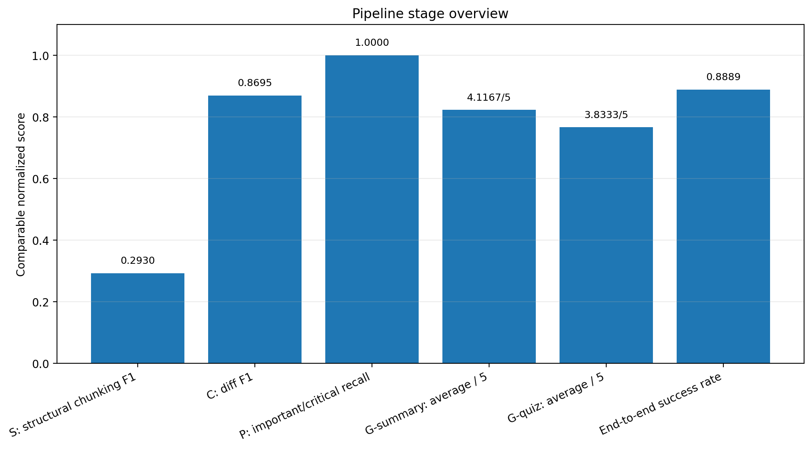
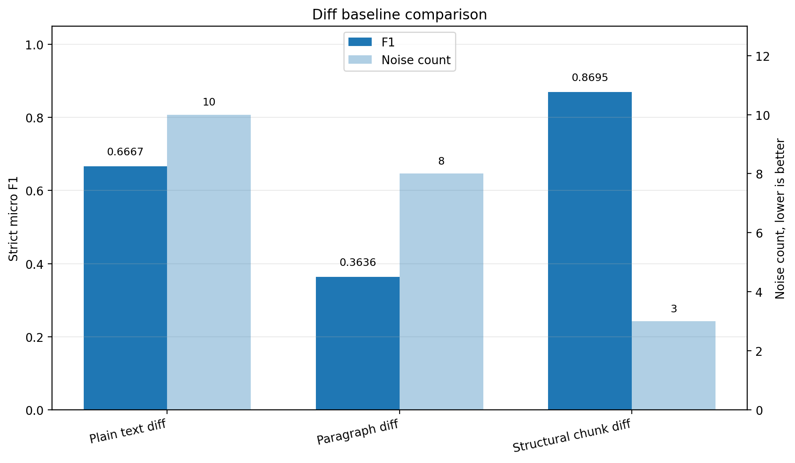
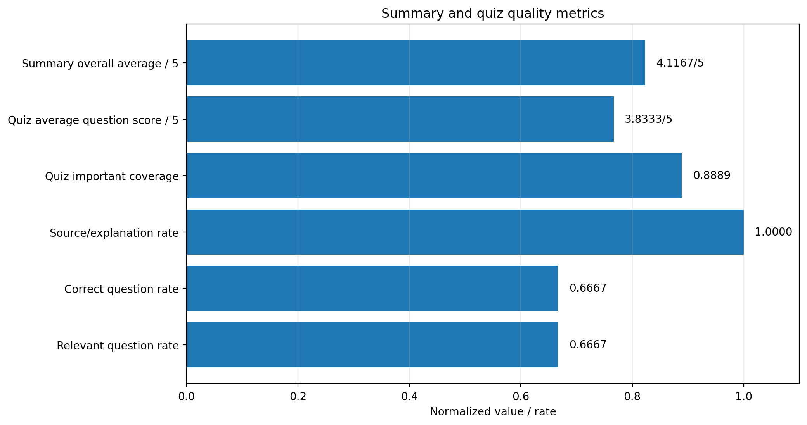
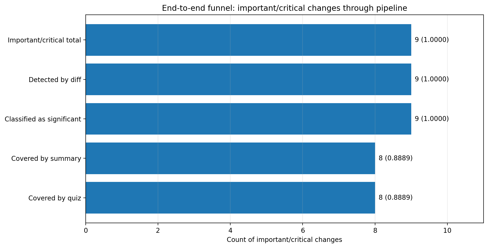
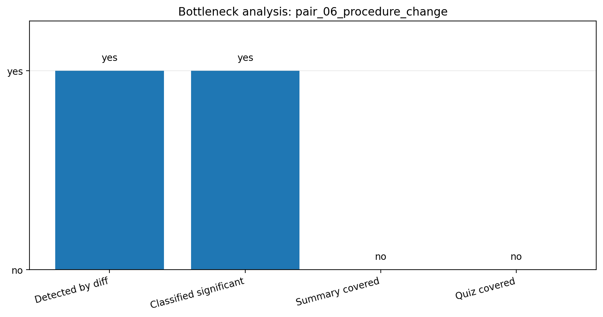

# Глава 3. Экспериментальная оценка разработанного гибридного метода

В данной главе приведена экспериментальная оценка разработанного гибридного метода интеллектуальной обработки нормативно-правовых и внутренних регламентных документов. Метод формализован как

```text
M = <E, N, S, C, P, G, R>,
```

где `E` — извлечение текста, `N` — нормализация, `S` — структурное разбиение, `C` — сравнение редакций, `P` — оценка значимости изменений, `G` — генерация выжимки и контрольно-обучающих материалов, `R` — фиксация результата прохождения. В рамках экспериментальной главы основное внимание уделяется тем компонентам, для которых в проекте были подготовлены воспроизводимые экспериментальные артефакты: `S`, `C`, `P`, `G-summary`, `G-quiz`, а также интегральной end-to-end оценке прохождения важных изменений через pipeline.

Экспериментальная оценка выполнялась на отдельном evaluation corpus и основана на уже подготовленных артефактах Фаз 14–20: CSV, JSON, PNG и Markdown-отчётах. Новые эксперименты, изменение backend, корректировка алгоритмов и ручное улучшение результатов в рамках данной главы не выполнялись. Поэтому результаты главы следует интерпретировать как анализ фактических результатов текущей версии MVP, а не как оценку гипотетически улучшенной реализации.

## 3.1. Цель и задачи экспериментальной оценки

Цель экспериментальной оценки состояла в проверке того, насколько разработанный гибридный метод позволяет воспроизводимо обнаруживать, структурировать, приоритизировать и материализовывать значимые изменения в регламентных документах в виде понятной выжимки и контрольно-обучающих материалов. В отличие от демонстрационного сценария, экспериментальная оценка была направлена не на показ интерфейса, а на измерение качества отдельных компонентов pipeline и выявление мест, где ошибки одного слоя могут влиять на последующие этапы.

Оценка была необходима по нескольким причинам. Во-первых, метод включает не один алгоритм, а последовательность взаимосвязанных этапов: структурное разбиение документа определяет единицы сравнения; comparison-layer формирует кандидаты изменений; significance-layer назначает приоритет; summary-layer преобразует технический diff в человекочитаемое объяснение; quiz generation превращает существенные изменения в проверочные вопросы. Во-вторых, в прикладном сценарии недостаточно показать качество каждого компонента отдельно: важное изменение должно пройти всю цепочку от обнаружения до отражения в summary и quiz. Поэтому наряду с частными экспериментами была проведена end-to-end оценка.

В рамках главы решались следующие задачи:

1. Оценить качество структурного разбиения документов на фрагменты, пригодные для последующего сравнения редакций.
2. Сравнить structural chunk diff с plain text и paragraph baselines по качеству обнаружения ключевых изменений и уровню шума.
3. Проверить, насколько deterministic/rule-based significance-layer выявляет important/critical изменения и отделяет их от редакционных или информационных изменений.
4. Оценить качество формирования краткой выжимки по изменениям, включая полноту покрытия ожидаемых тем и наличие unsupported claims.
5. Оценить применимость generated quiz questions как baseline контрольно-обучающих материалов.
6. Провести сводную end-to-end проверку прохождения important/critical изменений через diff, significance, summary и quiz.
7. Зафиксировать ограничения эксперимента, угрозы валидности и необходимость human-in-the-loop контроля.

Таким образом, экспериментальная оценка была организована как проверка применимости метода в рамках локального MVP-сценария. Она не ставила целью доказать универсальное превосходство метода над всеми существующими подходами к legal/document intelligence, но позволяла проверить, работает ли предложенный pipeline на подготовленном корпусе и какие ограничения необходимо учитывать при дальнейшем развитии системы.

Связующим элементом для всех последующих разделов является evaluation corpus: именно его структура, разметка и ограничения определяют корректный смысл полученных метрик.

## 3.2. Описание evaluation corpus

Для экспериментальной оценки был создан отдельный evaluation corpus, размещённый в каталоге `data/evaluation_corpus/`. Он содержит 10 синтетических пар документов, каждая из которых включает старую редакцию, новую редакцию и файл `annotation.json` с ручной разметкой. Корпус отделён от demo corpus: демонстрационный корпус предназначен для показа MVP pipeline, а evaluation corpus — для расчёта метрик и анализа ошибок.

Использование синтетического корпуса допустимо для первичной MVP-оценки по нескольким причинам. Во-первых, синтетические документы позволяют контролируемо задать типы изменений: сроки, обязанности, перечни документов, основания отказа, процедуру подачи, ответственность, редакционные изменения, структурный перенос и weakly structured fallback case. Во-вторых, синтетические данные не содержат персональных данных и не требуют использования реальных внутренних регламентов. В-третьих, для магистерского проекта на стадии MVP важна воспроизводимость: каждая пара документов имеет стабильную ручную аннотацию, по которой можно повторно запускать экспериментальные скрипты.

Разметка корпуса включает несколько уровней ожидаемого поведения pipeline: `expected_changes`, `expected_chunks`, `expected_significance`, `editorial_changes`, `expected_summary_topics`, `expected_quiz_topics`, а также дополнительные поля `known_difficulties`. Такая структура позволяет использовать один и тот же corpus для оценки этапов `S`, `C`, `P` и downstream-компонентов `G`.

**Таблица 3.1 — Характеристика evaluation corpus**

| Pair | Сценарий | Основной тип изменения | Ожидаемая значимость | Использование в оценке |
|---|---|---|---|---|
| `pair_01_deadline_change` | Изменение срока рассмотрения заявления | `modified` | `critical` | Chunking, diff, significance, summary, quiz |
| `pair_02_added_obligation` | Добавление обязанности уведомления заявителя | `added` | `critical` | Chunking, diff, significance, summary, quiz |
| `pair_03_document_list_change` | Добавление документа в обязательный перечень | `added` | `critical` | Chunking, diff, significance, summary, quiz |
| `pair_04_refusal_ground_change` | Добавление основания для отказа | `added` | `critical` | Chunking, diff, significance, summary, quiz |
| `pair_05_editorial_change` | Редакционное изменение без смыслового влияния | `modified` | `editorial` | Chunking, diff, significance, summary, no-quiz control |
| `pair_06_procedure_change` | Изменение порядка подачи заявления | `modified` | `important` | Chunking, diff, significance, summary, quiz |
| `pair_07_responsibility_change` | Добавление ответственности за нарушение срока | `added` | `critical` | Chunking, diff, significance, summary, quiz |
| `pair_08_reordered_structure` | Перенос фрагмента без изменения текста | `moved` | `editorial` | Chunking, diff, significance, summary, no-quiz control |
| `pair_09_mixed_significant_and_editorial` | Смешанные значимые, информационные и редакционные изменения | `added`, `modified` | `critical`, `editorial`, `informational` | Chunking, diff, significance, summary, quiz |
| `pair_10_weakly_structured_document` | Слабо структурированный документ | `modified` | `critical` | Chunking, diff, significance, summary, quiz |

Источник: `docs/evaluation/evaluation-corpus-description.md`.

Суммарно в корпусе размечено 13 expected changes: 6 `added`, 6 `modified` и 1 `moved`. По категориям значимости разметка включает 8 `critical`, 1 `important`, 1 `informational` и 3 `editorial` изменения. Для end-to-end оценки используются 9 important/critical изменений, поскольку именно они должны проходить downstream-цепочку до summary и quiz.

Корпус покрывает несколько типов задач. Для structural chunking используются `expected_chunks`, в которых заданы ожидаемые ключевые границы фрагментов. Для comparison-layer используются `expected_changes` и отдельный учёт editorial changes. Для significance-layer используются ожидаемые labels и semantic types. Для summary и quiz используются expected topics, то есть не дословные формулировки, а смысловые темы, которые должны быть отражены в итоговой выжимке или вопросах.

Ограничения корпуса принципиальны для корректной интерпретации результатов. Все документы являются синтетическими и небольшими по объёму; это ограничивает внешнюю валидность. Разметка является key-change / key-boundary annotation, а не полным full-document gold standard. Для `pair_08_reordered_structure` специально зафиксировано ограничение текущего moved detection, а для `pair_10_weakly_structured_document` предусмотрен fallback-сценарий без явной структуры. Поэтому результаты главы следует трактовать как проверку текущего MVP на контролируемом наборе типовых и пограничных ситуаций, а не как исчерпывающий benchmark для всех нормативных документов.

После описания корпуса можно перейти к общей методике экспериментов, поскольку именно выбранная схема оценки определяет набор метрик для каждого этапа метода.

## 3.3. Методика проведения экспериментов

Общая схема экспериментальной оценки строилась вокруг pipeline обработки пары редакций документа:

```text
document upload
→ document versioning
→ text extraction
→ normalization
→ structural chunking
→ version comparison
→ significance classification
→ summary
→ quiz generation
→ quiz approval workflow
→ employee attempt
→ result/reporting
```

В экспериментальных фазах 14–20 отдельно оценивались этапы `S`, `C`, `P` и два downstream-проявления этапа `G`: summary и quiz generation. Этапы `E`, `N` и `R` входят в общий MVP pipeline и важны для архитектуры системы, однако в данной серии экспериментов они не оценивались отдельными метриками качества. Такое ограничение связано с тем, что evaluation corpus представлен в формате TXT, что позволяет не смешивать качество extraction/OCR с качеством структурного анализа и downstream-генерации.

Для разных этапов использовались разные метрики, поскольку они решают разные задачи. Structural chunking оценивался через expected blocks, found blocks, correct boundaries, precision, recall и F1. Comparison-layer оценивался через TP, FP, FN, precision, recall, F1 и noise count. Significance-layer оценивался через exact-label accuracy, high-priority precision/recall/F1, editorial false positive rate и confusion matrix. Summary и quiz generation оценивались с использованием semi-expert rubric, поскольку качество человекочитаемого объяснения и корректность учебного вопроса нельзя надёжно измерить только лексическим совпадением.

**Таблица 3.2 — Сводные результаты по этапам метода**

| Этап метода | Компонент | Основной показатель | Значение | Интерпретация |
|---|---|---:|---:|---|
| S | Structural chunking | F1 / key recall | 0.2930 / 1.0000 | Лучший F1 среди baselines на selected key-boundary annotation; key recall = 1.0000 |
| C | Structural comparison | F1 / noise_count | 0.8695 / 3 | Снижает шум diff по сравнению с plain text и paragraph baselines |
| P | Significance | high-priority recall / F1 | 1.0000 / 0.8571 | Не пропускает important/critical changes на текущем corpus, но precision ниже из-за overclassification |
| G-summary | Summary | average score / coverage | 4.1167 / 8/9 | Формирует понятную выжимку, но зависит от upstream diff/significance |
| G-quiz | Quiz generation | average score | 3.8333 | Формирует применимые baseline questions при обязательном approval workflow |
| End-to-end | Full pipeline | success rate | 0.8889 (8/9) | 8 из 9 важных изменений прошли diff, significance, summary и quiz coverage |

Источник: `experiments/final_visuals/tables/table_01_experiment_summary.md`, `experiments/final/final_metrics_summary.json`.

Для обзорного представления результатов подготовлен рисунок 3.1. Он показывает нормализованные показатели качества этапов `S`, `C`, `P`, `G-summary`, `G-quiz` и end-to-end success rate. При интерпретации рисунка важно учитывать, что не все показатели имеют одинаковую природу: F1, recall и coverage уже находятся в диапазоне `[0, 1]`, тогда как scores summary и quiz были нормализованы делением на 5.

**Рисунок 3.1 — Сводная оценка этапов гибридного метода**



Источник: `experiments/final_visuals/figures/pipeline_stage_overview.png`.

End-to-end trace был построен отдельно для important/critical changes. Для каждого такого изменения проверялось, было ли оно найдено diff-layer, классифицировано как significant, покрыто summary topic и quiz topic. Это важно, поскольку отдельная высокая метрика на одном слое не гарантирует практической пригодности результата: например, изменение может быть обнаружено и правильно классифицировано, но не попасть в выжимку или вопрос.

Таким образом, методика объединяет component-level и pipeline-level оценку. Далее последовательно рассматриваются результаты по каждому компоненту, начиная с этапа структурного разбиения документов.

## 3.4. Оценка качества структурного разбиения документов

Этап `S — structural chunking` формирует базовые единицы, на которых далее работает comparison-layer. Для нормативных и внутренних регламентных документов это особенно важно: одинаковый текстовый diff может быть трудно интерпретировать без сведения о разделе, статье, пункте или подпункте, к которому относится изменение. Поэтому эксперимент Фазы 14 был направлен на проверку того, насколько разные способы разбиения документа находят ожидаемые ключевые границы фрагментов.

В эксперименте сравнивались три подхода:

1. `paragraph_baseline` — наивное разделение нормализованного текста по пустым строкам и paragraph boundaries.
2. `heading_article_baseline` — rule-based baseline по крупным заголовкам, статьям и числовым пунктам без полноценной поддержки lettered subpoints и fallback-стратегии production pipeline.
3. `hybrid_structural` — текущий production-подход проекта, использующий `materialize_document_text` и `chunk_by_structure_ru` с распознаванием структурных маркеров, `path_key`, `section_path` и fallback-блоков.

Метрики рассчитывались на основе ручной разметки `expected_chunks`. Для каждого метода учитывались `expected_blocks`, `found_blocks`, `correct_boundaries`, precision, recall и F1. Expected chunk засчитывался как найденный, если ожидаемый boundary text содержался в одном из найденных chunks с учётом one-to-one matching. Такая постановка специально оценивает selected key-boundary annotation, а не все возможные границы документа.

**Таблица 3.3 — Результаты оценки structural chunking**

| Метод | Expected blocks | Found blocks | Correct boundaries | Precision | Recall | F1 | Key recall |
|---|---:|---:|---:|---:|---:|---:|---:|
| Paragraph baseline | 23 | 106 | 18 | 0.1698 | 0.7826 | 0.2791 | 0.8571 |
| Heading/article baseline | 23 | 209 | 20 | 0.0957 | 0.8696 | 0.1724 | 0.8571 |
| Hybrid structural chunking | 23 | 134 | 23 | 0.1716 | 1.0000 | 0.2930 | 1.0000 |

Источник: `experiments/chunking/chunking_summary.json`, `docs/experiments/chunking-evaluation.md`.

На подготовленном corpus `hybrid_structural` нашёл все 23 expected boundaries и достиг recall = 1.0000, key recall = 1.0000 и micro F1 = 0.2930. Это лучший F1 среди сравниваемых методов, хотя absolute precision остаётся низким. Низкая precision объясняется консервативной постановкой эксперимента: метод штрафуется за все найденные chunks, которые не входят в selected annotation, даже если они являются допустимыми структурными фрагментами документа. Поэтому precision в данном эксперименте не следует трактовать как долю «ошибочных» фрагментов во всём документе; она отражает строгое сопоставление с ограниченным набором размеченных key boundaries.

Paragraph baseline оказался относительно устойчивым на некоторых слабо структурированных случаях, поскольку структура абзацев в corpus частично совпадает с fallback-блоками. Однако он чаще объединял несколько смысловых единиц в один блок и пропускал часть ключевых boundaries. Heading/article baseline показывал высокий recall на крупных структурных элементах, но был склонен к переизбыточному разбиению и хуже работал с подпунктами и fallback-сценариями. Hybrid structural chunking оказался более сбалансированным для задач downstream comparison, поскольку он учитывает как структурные markers, так и fallback logic.

Главный вывод эксперимента состоит в том, что structural chunking создаёт более подходящую основу для последующего сравнения редакций, чем простое paragraph-разбиение или ограниченный heading/article baseline. Однако результат ограничен key-boundary annotation: он не доказывает наличие полного full-document segmentation gold standard и не оценивает все возможные корректные варианты сегментации документа.

Для визуального контекста данного раздела используется обзорный рисунок 3.1 «Сводная оценка этапов гибридного метода». Следующий раздел показывает, как качество structural chunking влияет на этап `C — comparison`.

## 3.5. Оценка качества сравнения редакций документов

Этап `C — comparison` отвечает за выявление изменений между старой и новой редакциями документа. Его результат используется significance-layer, summary-layer и quiz generation, поэтому для pipeline важно не только найти изменения, но и не передать downstream-этапам избыточный шум. Эксперимент Фазы 15 сравнивал production structural chunk diff с двумя baseline-подходами: plain text diff и paragraph diff.

Plain text diff сравнивает минимально нормализованный текст построчно. Такой подход прост, но чувствителен к перенумерации пунктов, вставкам и локальным структурным сдвигам. Paragraph diff сравнивает более крупные блоки, разделённые пустыми строками, и поэтому снижает часть line-level шума, но может объединять несколько смысловых изменений внутри одного блока. Structural chunk diff использует результат этапа `S`: chunks с `text_hash`, `path_key`, `canonical_label`, `section_path`, heading, lexical similarity и fallback matching.

Strict evaluation выполнялась по meaningful/key expected changes. Editorial-only predictions учитывались как noise, если они не закрывали meaningful expected change. Такая постановка отражает практическую задачу: downstream summary и quiz должны фокусироваться на содержательных изменениях, а не на каждой технической или редакционной разнице.

**Таблица 3.4 — Сравнение diff-подходов**

| Метод | F1 | Noise count |
|---|---:|---:|
| Plain text diff | 0.6667 | 10 |
| Paragraph diff | 0.3636 | 8 |
| Structural chunk diff | 0.8695 | 3 |

Источник: `experiments/final_visuals/tables/table_02_diff_comparison.md`, `experiments/diff/diff_summary.json`.

**Рисунок 3.2 — Сравнение методов обнаружения изменений**



Источник: `experiments/final_visuals/figures/diff_baseline_comparison.png`.

Structural chunk diff показал лучший strict micro F1 = 0.8695 и наименьший noise_count = 3. Для plain text diff F1 составил 0.6667 при noise_count = 10, а для paragraph diff F1 составил 0.3636 при noise_count = 8. Это означает, что структурное сравнение не только сохраняет высокий recall для key changes, но и уменьшает количество ложных изменений, которые могли бы попасть в significance-layer.

Причины различий между подходами связаны с природой документов. Plain text diff хорошо обнаруживает простые line-level изменения, но создаёт ложные срабатывания при перенумерации и вставках. Paragraph diff иногда оказывается слишком грубым: если внутри одного абзацного блока есть несколько пунктов, изменение подпункта может быть представлено как изменение всего блока. Structural chunk diff использует структурные anchors и поэтому лучше удерживает связь изменения с конкретным пунктом, подпунктом или fallback-блоком.

Ограничение результата состоит в том, что оценка относится к strict key-change evaluation, а не к full-document gold standard. В corpus размечены ключевые изменения, а не все возможные текстовые различия между редакциями. Поэтому корректная формулировка вывода такова: на подготовленном evaluation corpus structural comparison снизил количество ложных изменений и повысил интерпретируемость diff по сравнению с plain text и paragraph baselines.

Результат этапа `C` напрямую влияет на significance-layer: если comparison создаёт шум, слой `P` может попытаться назначить этому шуму значимость. Поэтому следующий раздел рассматривает качество классификации значимости изменений.

## 3.6. Оценка качества определения значимости изменений

Этап `P — prioritization / significance` предназначен для отделения practically important changes от низкоприоритетных, информационных или редакционных изменений. В текущей версии проекта significance-layer реализован как deterministic/rule-based baseline. Он извлекает признаки изменения, определяет semantic type, назначает `significance_label`, score, reason, triggered rules и признак необходимости ручной проверки.

В эксперименте Фазы 16 основной запуск выполнялся в oracle-change режиме: на вход подавались корректные change spans из annotation, но gold `importance` и gold `semantic_type` не передавались классификатору. Это позволило оценить собственно слой `P`, отделив его от ошибок поиска изменений на этапе `C`. Дополнительно был сохранён semantic-hint diagnostic, но он трактуется только как верхняя граница при идеальном semantic-type сигнале и не смешивается с основной метрикой.

Считались exact-label accuracy, high-priority precision/recall/F1 для positive class `{critical, important}`, editorial false positive rate, macro/weighted F1 и confusion matrix. Для прикладного MVP наиболее важна binary high-priority постановка: critical/important изменения не должны быть потеряны, поскольку именно они должны попасть в summary и quiz.

**Таблица 3.5 — Результаты оценки significance-layer**

| Показатель | Значение |
|---|---:|
| Total expected changes | 13 |
| Accuracy | 0.6923 |
| Important/Critical precision | 0.7500 |
| Important/Critical recall | 1.0000 |
| Important/Critical F1 | 0.8571 |
| Editorial false positive rate | 0.6667 |
| Editorial high-priority FP rate | 0.6667 |
| Macro F1 | 0.4416 |
| Weighted F1 | 0.7154 |
| Manual review rate | 0.3077 |

Источник: `experiments/significance/significance_summary.json`, `docs/experiments/significance-evaluation.md`.

На текущем corpus significance-layer не пропустил ни одного important/critical изменения: important/critical recall = 1.0000. Это означает, что deadline, obligation, refusal ground, responsibility и important procedure changes были отнесены к high-priority классу. F1 для high-priority класса составил 0.8571, что отражает сочетание полного recall и ограниченной precision.

Основные ошибки связаны не с пропуском важных изменений, а с завышением отдельных низкоприоритетных случаев. В частности, две редакционные замены были подняты до `important`, а одно informational change также было классифицировано как `important`. Такой характер ошибок типичен для recall-oriented deterministic baseline: он настроен так, чтобы не пропустить потенциально важное изменение, но в спорных случаях может направить элемент на ручную проверку или завысить его приоритет.

С практической точки зрения это приемлемо для MVP только при наличии human-in-the-loop контроля. Significance-layer не должен интерпретироваться как замена эксперта или юридической оценки. Его роль — первичная приоритизация и подготовка входа для summary/quiz, при этом reviewer должен иметь возможность отклонить или исправить спорные highlights и вопросы.

Ограничения эксперимента включают малый synthetic corpus, key-change gold standard вместо exhaustive benchmark, oracle-change режим основной оценки и rule-based природу классификатора. Тем не менее результаты подтверждают, что текущий слой `P` пригоден как recall-oriented baseline для дальнейшего pipeline, если downstream stages не используют его выход без проверки.

Далее рассматривается, как результаты diff и significance преобразуются в человекочитаемую выжимку.

## 3.7. Оценка качества формирования выжимки по изменениям

Summary-layer относится к этапу `G` и предназначен для того, чтобы преобразовать технические результаты comparison/significance в понятное описание изменений. Для пользователя важен не только список raw diff items, но и краткое объяснение: какие изменения существенны, к каким темам они относятся и почему требуют внимания. Поэтому эксперимент Фазы 17 оценивал generated summary по semi-expert rubric.

Оценка включала шесть критериев: completeness, accuracy, no hallucinations, clarity, usefulness и source alignment. Каждый критерий оценивался по шкале 1–5. Кроме того, отдельно учитывались covered topics, missed topics, unsupported claims и editorial/noise overemphasis. Такая схема была выбрана потому, что качество summary нельзя корректно свести только к лексическому совпадению с expected text: требуется оценить смысловое покрытие, аккуратность формулировки и связь с исходными change items.

**Таблица 3.6 — Результаты оценки summary-layer**

| Показатель | Значение |
|---|---:|
| Overall average | 4.1167 |
| Covered topics | 8 / 9 |
| Missed topics | 1 |
| Unsupported claims | 5 |
| Editorial/noise overemphasis | 4 |

Источник: `experiments/summary/summary_evaluation_summary.json`, `docs/experiments/summary-evaluation.md`.

Summary-layer показал overall average = 4.1167 и покрыл 8 из 9 expected important topics. Сильные результаты были получены для изменений сроков, обязанностей, перечня документов, основания отказа и weakly structured deadline case. Это подтверждает, что summary делает technical diff/significance results более понятными для пользователя и может служить промежуточным explanatory layer между comparison и quiz generation.

В то же время эксперимент выявил ограничения. Зафиксировано 5 unsupported claims и 4 случая editorial/noise overemphasis. Наиболее важный missed topic связан с `pair_06_procedure_change`: expected topic про возможность подачи заявления через электронную форму во внутреннем портале не был корректно отражён в summary. В некоторых слабых случаях summary наследовал upstream overclassification: editorial или informational изменения, завышенные significance-layer, попадали в выжимку как более важные highlights.

Для визуального сопоставления качества summary и quiz generation подготовлен рисунок 3.3. Он показывает summary overall average, quiz average question score, quiz coverage, source/explanation rate, correct question rate и relevant question rate.

**Рисунок 3.3 — Качество summary и quiz generation**



Источник: `experiments/final_visuals/figures/summary_quiz_quality.png`.

Корректная интерпретация результатов summary-layer состоит в том, что он полезен как human-readable representation, но его качество зависит от upstream representation. Если diff или significance формируют широкий, шумовой или неверно классифицированный highlight, summary может усилить эту ошибку в человекочитаемой форме. Поэтому summary следует использовать как вспомогательный слой, требующий проверки в ответственных сценариях, а не как автономное юридическое заключение.

Следующий раздел показывает, как downstream representation влияет на генерацию контрольно-обучающих материалов.

## 3.8. Оценка качества генерации контрольно-обучающих материалов

Quiz generation также относится к этапу `G`, но решает другую прикладную задачу: преобразует значимые изменения в single-choice вопросы для последующего обучения и контроля сотрудников. В MVP это не автономный экзаменационный модуль, а baseline generation layer, который должен проходить approval workflow ответственным лицом перед использованием сотрудниками.

Эксперимент Фазы 18 оценивал production function `build_quiz_from_summary(...)` в pipeline mode. На вход подавались результаты реальной цепочки `chunk_by_structure_ru -> build_version_diff -> build_brief_summary -> build_quiz_from_summary`. Поэтому метрики quiz generation отражают не только качество шаблонов вопросов, но и ошибки upstream stages. Дополнительно был сохранён oracle diagnostic, который показывает поведение генератора при корректном annotation-driven входе, но он не считается основным pipeline score.

Каждый вопрос оценивался по семи критериям: change relevance, legal/domain correctness, unambiguous correct answer, distractor quality, no editorial noise, explanation/source quality и employee usefulness. Рассчитывались important change coverage, average question score, source/explanation rate, correct question rate и relevant question rate.

**Таблица 3.7 — Результаты оценки quiz generation**

| Показатель | Значение |
|---|---:|
| Important change coverage | 0.8889 |
| Average question score | 3.8333 |
| Source/explanation rate | 1.0000 |
| Correct question rate | 0.6667 |
| Relevant question rate | 0.6667 |
| Editorial/noise question rate | 0.2500 |
| Total questions | 12 |

Источник: `experiments/quiz/quiz_evaluation_summary.json`, `docs/experiments/quiz-generation-evaluation.md`.

Quiz generation покрыл 8 из 9 expected important/critical topics, что соответствует coverage = 0.8889. Все сгенерированные вопросы имели source/explanation metadata, поэтому source/explanation rate составил 1.0000. Это важное свойство для reviewer: наличие source reference позволяет проверить, действительно ли вопрос основан на корректном изменении документа.

При этом correct question rate и relevant question rate составили по 0.6667. Это умеренные значения, показывающие, что часть вопросов нельзя использовать без проверки. Слабые вопросы возникали преимущественно в случаях upstream noise или неверного semantic framing. Например, `pair_05_editorial_change` был превращён в вопрос по editorial replacement, а `pair_06_procedure_change` использовал реальный source fragment, но неверно сформулировал проверяемую тему и не покрыл электронную форму подачи заявления.

Отдельно важно подчеркнуть роль approval workflow. В проекте generated quiz должен пройти состояния `draft -> pending_review -> approved/rejected`; employee attempts разрешаются только для approved quiz. Это не является формальной деталью интерфейса, а выполняет функцию safety/quality gate: responsible person проверяет legal wording, source reference, correct answer, distractors и отсутствие вопросов по editorial/noise.

Следовательно, quiz generation практически полезен как baseline контрольно-обучающий слой, но не является автономной заменой методиста или эксперта. Его результаты можно использовать в MVP при условии обязательного human-in-the-loop approval.

Далее отдельные результаты summary и quiz объединяются в end-to-end анализ прохождения важных изменений через весь pipeline.

## 3.9. Сводная end-to-end оценка гибридного метода

Component-level эксперименты показывают качество отдельных этапов, но прикладная ценность метода определяется тем, проходит ли important/critical change весь pipeline: от обнаружения в diff до отражения в summary и quiz. Поэтому в Фазах 19–20 была выполнена integrated evaluation, объединяющая результаты Фаз 14–18.

End-to-end trace был построен для 9 important/critical expected changes. Для каждого изменения фиксировались четыре условия: обнаружено ли оно structural diff, классифицировано ли как significant, покрыто ли summary topic и покрыто ли quiz topic/question. Strict end-to-end success означает одновременное выполнение всех условий.

**Таблица 3.8 — End-to-end coverage важных изменений**

| Pipeline step | Count | Rate |
|---|---:|---:|
| Important/critical total | 9 | 1.0000 |
| Detected by diff | 9 | 1.0000 |
| Classified as significant | 9 | 1.0000 |
| Covered by summary | 8 | 0.8889 |
| Covered by quiz | 8 | 0.8889 |
| Strict end-to-end success | 8 | 0.8889 |

Источник: `experiments/final_visuals/tables/table_03_end_to_end_coverage.md`, `experiments/final/end_to_end_summary.json`.

**Рисунок 3.4 — End-to-end funnel прохождения важных изменений через pipeline**



Источник: `experiments/final_visuals/figures/end_to_end_funnel.png`.

Результат показывает, что все 9 important/critical changes были найдены diff-layer и классифицированы как significant. Downstream-покрытие ниже: summary покрыл 8 из 9 тем, quiz также покрыл 8 из 9 тем. Strict end-to-end success count составил 8 из 9, а strict end-to-end success rate — 0.8889. Practical end-to-end success rate в текущем corpus также равен 0.8889.

Основной bottleneck зафиксирован для `pair_06_procedure_change`. Это изменение было обнаружено comparison-layer и классифицировано significance-layer как important, однако downstream summary и quiz не покрыли expected topic про электронную форму подачи заявления во внутреннем портале. Иными словами, сбой произошёл не на уровне обнаружения изменения и не на уровне high-priority classification, а на уровне downstream representation и topic coverage.

**Рисунок 3.5 — Анализ bottleneck для `pair_06_procedure_change`**



Источник: `experiments/final_visuals/figures/bottleneck_analysis.png`.

End-to-end результат подтверждает применимость pipeline в рамках подготовленного evaluation corpus: большинство важных изменений проходят через ключевые стадии метода до summary и quiz. Одновременно результат не снимает ограничений. Он показывает конкретное место, где требуется улучшение semantic representation и downstream generation, а также подтверждает необходимость review stage.

Следующий раздел систематизирует ошибки и ограничения, выявленные при component-level и end-to-end оценке.

## 3.10. Анализ ошибок и ограничений

Анализ ошибок показывает, что в гибридном pipeline важны не только локальные ошибки отдельных компонентов, но и propagation errors. Ошибка или шум на раннем этапе может изменить вход последующих слоёв и привести к заметному искажению final artifacts: summary или quiz question.

Первый тип propagation error связан с structural chunking. Если key boundary выделяется слишком широко, слишком узко или сливается с соседним фрагментом, comparison-layer может получить неверную единицу сравнения. В текущем corpus hybrid structural chunking нашёл все expected key boundaries, но сама постановка оценки ограничена selected key-boundary annotation. Поэтому нельзя утверждать, что все возможные границы документа всегда будут выделены корректно.

Второй тип ошибок связан с diff noise. Structural chunk diff снизил noise_count по сравнению с plain text и paragraph baselines, но не устранил шум полностью. Если comparison-layer передаёт editorial или informational change как candidate semantic change, significance-layer пытается назначить ему label. В recall-oriented baseline это может приводить к overclassification.

Третий тип ошибок связан с significance overclassification. В эксперименте две editorial замены были классифицированы как important, а одно informational change также было поднято до important. Downstream summary и quiz воспринимают такие highlights как допустимые candidates, поэтому editorial/noise может быть усилен в человекочитаемом тексте и вопросах.

Четвёртый тип ошибок связан с downstream omission. В `pair_06_procedure_change` изменение было найдено и классифицировано как important, но summary и quiz не покрыли expected topic про электронную форму подачи заявления. Это показывает, что даже корректное upstream detection не гарантирует достаточного topic coverage на уровне `G`.

**Таблица 3.9 — Основные ограничения экспериментальной оценки**

| Ограничение | Влияние | Как учитывается |
|---|---|---|
| Synthetic corpus | Ограничивает external validity | Выводы формулируются для подготовленного MVP corpus, без обобщения на все регламентные документы |
| Key-change annotation | Не является full-document gold standard | Метрики трактуются как проверка ключевых изменений/границ, а не полной юридической полноты |
| Rule-based significance | Может завышать editorial/informational noise | Слой `P` описывается как recall-oriented baseline; human-in-the-loop обязателен |
| Summary unsupported claims | Может влиять на downstream quiz | Unsupported claims и editorial/noise overemphasis фиксируются отдельными метриками |
| Quiz baseline nature | Не гарантирует полностью корректные вопросы | Approval ответственным лицом обязателен перед практическим применением |

Источник: `experiments/final_visuals/tables/table_05_limitations.md`.

Ограничения также включают малый размер corpus, отсутствие OCR/PDF extraction variability в эксперименте, отсутствие полного legal gold standard, semi-expert характер оценки summary/quiz и baseline-природу generated questions. Эти ограничения не отменяют результатов, но задают границы допустимых выводов. Корректно утверждать, что метод показал применимость в рамках MVP и подготовленного evaluation corpus; некорректно утверждать, что система полностью автоматизирует юридическую экспертизу или заменяет эксперта.

Поскольку часть ограничений связана не только с ошибками реализации, но и с дизайном эксперимента, отдельно рассматриваются threats to validity.

## 3.11. Угрозы валидности эксперимента

### Внутренняя валидность

Внутренняя валидность зависит от качества ручной разметки. Если annotation неполна или неоднозначна, рассчитанные precision, recall, F1 и coverage могут смещаться. Особенно это важно для границы между `editorial`, `informational` и `important`, где экспертная интерпретация может зависеть от доменного контекста.

Дополнительная угроза состоит в зависимости этапов pipeline друг от друга. Ошибка structural chunking может изменить результат diff; diff noise может повлиять на significance; significance overclassification может усилиться в summary и quiz. Поэтому component-level метрики не являются полностью независимыми, а end-to-end результат отражает совместный эффект нескольких слоёв.

Для summary и quiz использовалась semi-expert rubric. Такая оценка необходима для смысловых критериев, но она менее формальна, чем полностью автоматическое сравнение с gold labels. Это следует учитывать при интерпретации scores 1–5.

### Внешняя валидность

Evaluation corpus является синтетическим и небольшим: 10 пар документов. Он покрывает несколько важных сценариев, но не отражает всё разнообразие реальных нормативно-правовых актов, внутренних регламентов, приложений, таблиц, сканов, сложных ссылок и конфликтующих правовых норм. Поэтому результаты нельзя автоматически переносить на промышленные архивы документов без расширения corpus и дополнительных экспериментов.

Формат TXT был выбран осознанно, чтобы не смешивать оценку document intelligence pipeline с качеством extraction. Однако это означает, что в главе не оцениваются OCR, сложные PDF, вложенные таблицы DOCX и ошибки извлечения текста. Для практического внедрения эти аспекты потребуют отдельной проверки.

### Конструктная валидность

Key-change annotation измеряет обнаружение и прохождение выбранных ключевых изменений, но не является full-document legal diff. Поэтому высокие значения recall для key changes не означают полной юридической полноты анализа документа. Аналогично expected summary topics и expected quiz topics проверяют смысловое покрытие важных тем, а не исчерпывающее соответствие всем возможным формулировкам.

Для significance-layer positive class `{critical, important}` отражает прикладную потребность MVP: не пропустить изменения, требующие внимания. Такая постановка оправдана для recall-oriented baseline, но она не заменяет более тонкую юридическую классификацию severity. Для quiz generation показатель source/explanation rate показывает traceability, но не гарантирует correctness вопроса, что видно по различию между source/explanation rate = 1.0000 и correct/relevant question rate = 0.6667.

### Воспроизводимость

Воспроизводимость обеспечивается тем, что входные данные, annotation, отчёты, CSV, JSON и PNG сохранены в repository. Основные результаты находятся в `docs/experiments/`, `data/evaluation_corpus/`, `experiments/chunking/`, `experiments/diff/`, `experiments/significance/`, `experiments/summary/`, `experiments/quiz/`, `experiments/final/` и `experiments/final_visuals/`.

Pipeline и экспериментальные скрипты являются deterministic baseline и могут быть локально перезапущены. Для проверки corpus используется `python scripts/validate_evaluation_corpus.py`, для агрегации результатов — `python experiments/final/aggregate_experiment_results.py`, для построения финальных визуализаций — `python experiments/final_visuals/build_final_figures.py`. При этом повторный запуск должен выполняться без изменения backend, алгоритмов и evaluation corpus, если цель состоит именно в воспроизведении результатов Фаз 14–20.

Указанные threats to validity задают рамку для итоговых выводов главы.

## 3.12. Выводы по главе 3

В главе была проведена экспериментальная оценка разработанного гибридного метода для работы с нормативно-правовыми и внутренними регламентными документами. На основе подготовленных артефактов Фаз 14–20 можно сформулировать следующие выводы.

1. Созданный evaluation corpus позволил провести воспроизводимую проверку метода. Корпус содержит 10 синтетических пар документов, ручную разметку expected changes, expected chunks, significance labels, summary topics и quiz topics. Он отделён от demo corpus и предназначен именно для измерения качества.

2. Structural chunking показал лучший recall и лучший F1 среди рассмотренных способов разбиения на selected key-boundary annotation. Hybrid structural chunking достиг micro recall = 1.0000, key recall = 1.0000 и micro F1 = 0.2930. Результат следует трактовать как проверку key-boundary detection, а не как full-document segmentation benchmark.

3. Structural comparison улучшил качество обнаружения изменений относительно plain text и paragraph baselines. На strict key-change evaluation structural chunk diff получил F1 = 0.8695 и noise_count = 3, тогда как plain text diff имел F1 = 0.6667 и noise_count = 10, а paragraph diff — F1 = 0.3636 и noise_count = 8.

4. Significance-layer работает как recall-oriented deterministic baseline. На текущем corpus important/critical recall составил 1.0000, а important/critical F1 — 0.8571. При этом зафиксирована склонность к overclassification отдельных editorial/informational changes, поэтому слой `P` требует human-in-the-loop контроля и не заменяет экспертную оценку.

5. Summary-layer делает технические результаты diff/significance более понятными для пользователя. Overall average составил 4.1167, covered topics — 8 из 9. Однако unsupported claims и editorial/noise overemphasis показывают зависимость summary от upstream representation.

6. Quiz generation покрывает большинство важных изменений и формирует применимые baseline контрольно-обучающие материалы. Important change coverage составил 0.8889, average question score — 3.8333, source/explanation rate — 1.0000. Одновременно correct/relevant question rate = 0.6667 показывает, что approval workflow является обязательным quality gate.

7. Сводная end-to-end оценка показала strict end-to-end success rate = 0.8889: 8 из 9 important/critical changes прошли diff detection, significance classification, summary coverage и quiz coverage. Основной bottleneck — `pair_06_procedure_change`, где изменение было найдено и классифицировано, но downstream summary/quiz не покрыли expected topic про электронную форму подачи заявления.

8. Полученные результаты подтверждают применимость гибридного метода в рамках локального MVP-сценария, но требуют осторожной интерпретации. Ограничения связаны с малым synthetic corpus, key-change annotation вместо full-document gold standard, rule-based nature significance-layer, baseline quiz generation и необходимостью human-in-the-loop проверки.

Таким образом, глава 3 показывает, что предложенный метод способен проводить большинство важных изменений через pipeline от структурного анализа до контрольных материалов, а также выявляет конкретные ограничения, которые должны быть учтены в дальнейших версиях системы и в финальной редакции диссертации.
